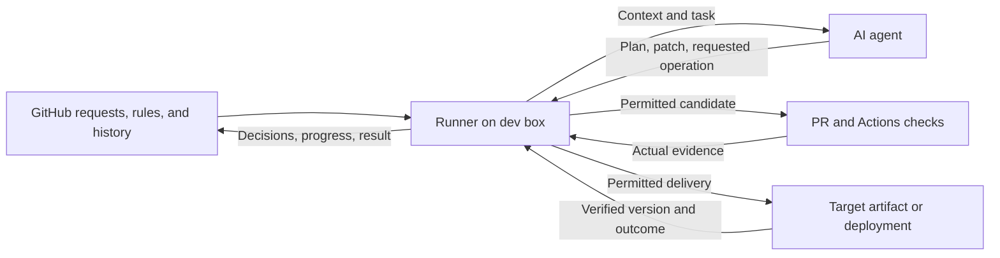
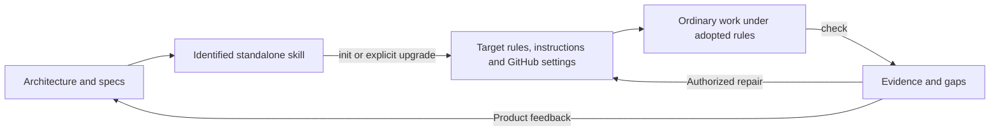
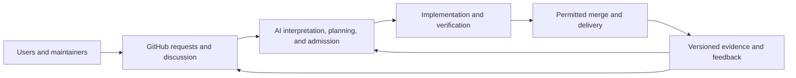
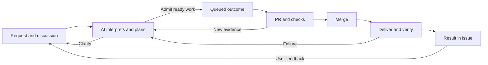

# YOLO Dev adopted protocol

Protocol format: `github-v1` · Candidate L1 distribution

Source: [811b996740d19face87c4f7b7dc0d741b84111d4](https://github.com/normzhou/yolo-dev/tree/811b996740d19face87c4f7b7dc0d741b84111d4). All required rules and procedures are below; upstream links are optional publisher context or tool documentation. The target supplies its own purpose and accepted authority, not YOLO Dev's Charter. Installing these rules does not qualify or authorize a target. L2 descriptions do not activate an unbuilt runner.

Source status notes describe the publisher at that revision, not this target's setup. This generated document preserves the design text; source links are rewritten to local sections wherever the referenced contract is included. The bundle's `provenance.json` records source digests and selections. Target adoption records retain this source identity and this file's digest.

## Contents

- [architecture](#architecture-adoption-levels)

- [operating-protocol](#operating-protocol-operating-protocol)

- [activities](#activities-agent-activities)

- [repo-layout](#repo-layout-repository-layout)

- [issue-management](#issue-management-issue-management)

- [repo-rules](#repo-rules-repository-rules-and-authority)

- [verification-delivery](#verification-delivery-verification-and-delivery)

- [qualification](#qualification-compliance-and-qualification-evidence)

- [adoption-records](#adoption-records-adoption-and-evidence-records)

- [github-workflow](#github-workflow-github-operating-workflow)

- [request-interface](#request-interface-request-to-result-interface)

- [onboarding](#onboarding-onboarding-and-check)

- [assisted-development](#assisted-development-assisted-distribution)

- [issue-delivery](#issue-delivery-issue-delivery-runner)


<a id="architecture-adoption-levels"></a>
### Adoption levels


| Level | Capability |
| --- | --- |
| L0 · Baseline | AI coding with your own workflow; no YOLO protocol. |
| L1 · Assisted | Maintainer-started harness sessions; AI aligns intent, code and progress through adopted rules/shared records. |
| L2 · Autopilot | Requests automatically reach verified delivery within the grant, without human code approval. |
| L3 · Self-directed | AI identifies useful improvements from use, feedback and maintenance evidence, then delivers them. |
| L4 · Living App | Your app engages users about needs/outcomes, closing use → work → improvement → feedback. |

Ownership does not change across levels; [qualification](#qualification-compliance-and-qualification-evidence) demonstrates capability for a target/revision/route. L1 provides procedural assurance; L2 adds enforced boundaries.

<a id="architecture-system-boundary"></a>
### System boundary

From L2:



AI plans and adapts; the [runner](#issue-delivery-issue-delivery-runner) reconciles context and enforces authority/evidence before operations. Begin on a user-controlled dev box with isolated workspaces and publishing privilege outside candidates. Actions handles automated CI/CD; targets supply delivery access.

GitHub/pushed Git hold durable state. Disposable sessions restart by reconciling existing effects, feedback and pause.

<a id="architecture-agent-interaction"></a>
#### Agent interaction

One repo installation exposes a shared `yolo` skill through [native harness bindings](#assisted-development-harness-bindings), with [init, check, request, work, feedback and help](#activities-agent-activities). Bindings pass text to the same procedures; switching harnesses retains adopted rules and shared progress. L1's maintainer starts sessions; L2 automatically starts the same work procedure. Direct conversation steers through shared records; a bypass requires an explicit owner override.

<a id="architecture-request-surface-and-user-visible-delivery"></a>
#### Request surface and user-visible delivery

Users/maintainers discuss through issues/comments, optionally [inside the app](#request-interface-request-to-result-interface). AI manages interpretation/progress/results; UI shows records and actual availability without a parallel project database or app-side model.

<a id="architecture-dimensions-of-conformity"></a>
### Dimensions of conformity

| Dimension | Opinion | Contract |
| --- | --- | --- |
| Governing context | Separate intent, design and implementation; complete local rules and ordinary loading. | [Protocol](#operating-protocol-operating-protocol), [layout](#repo-layout-repository-layout) |
| Project management | AI admits outcomes and manages labels, summaries and linked PRs; people steer/contest. | [Issues](#issue-management-issue-management), [workflow](#github-workflow-github-operating-workflow) |
| Authority | PRs with current authorization/evidence; protected approval, ordinary autonomy, identifiable overrides. | [Repo rules](#repo-rules-repository-rules-and-authority) |
| Delivery | Target-defined checks/routes; verify actual delivered outcomes. | [Verification/delivery](#verification-delivery-verification-and-delivery) |
| Evidence | Preserved identity, context, history and findings; cited capability. | [Records](#adoption-records-adoption-and-evidence-records), [qualification](#qualification-compliance-and-qualification-evidence) |

Reserve `.yolo/` for governing context, adopted protocol, adoption record and optional reports. [Layout](#repo-layout-repository-layout) defines exact slots/mappings; app and native tooling keep useful conventions.

<a id="architecture-establishing-and-maintaining-conformity"></a>
### Establishing and maintaining conformity



[Init/check](#onboarding-onboarding-and-check) propose/apply setup and review ongoing work. The [standalone bundle](#assisted-development-assisted-distribution) carries enough information for another harness without upstream checkout/chat. Ordinary loading, factual observation and semantic review sustain conformity; L2 also enforces execution preconditions.

Repair the lowest sufficient layer. Target defects stay there; YOLO defects feed back here. Setup, active preparedness and qualification are distinct evidence claims.

<a id="architecture-product-source-and-applied-adoption"></a>
### Product source and applied adoption

**Charter → architecture/specs → implementation and published artifacts.**

One co-owned design layer defines shared opinions/acceptance; AI realizes them as skills, helpers, templates, tests and published rules. Targets supply their own purpose/grant. An installed skill and adopted snapshot have separate lifetimes; source/publication changes cannot silently upgrade a pin. YOLO self-use follows the same explicit adoption route.

<a id="architecture-document-homes"></a>
#### Document homes

| Home | Role |
| --- | --- |
| Charter | Human-owned intent/authority for this product. |
| Architecture/specs | Co-owned design/acceptance for protocol, onboarding, distribution and runner. |
| Implementation/artifacts | AI-maintained realizations. |
| README, AGENTS, brainstorm | Visitor explanation, agent entry and exploration/history; ownership follows meaning. |
| Target `.yolo/` and GitHub | Applied context, configuration, work and evidence. |


<a id="operating-protocol-operating-protocol"></a>
## Operating protocol

**The target supplies purpose; YOLO supplies coordinated progress toward it.** The [architecture](#architecture-adoption-levels) connects these contracts. They apply to every adopter, including YOLO Dev, under its own Charter and authority.

<a id="operating-protocol-responsibilities-and-ownership"></a>
### Responsibilities and ownership

| Surface | Responsibility and ownership |
| --- | --- |
| Charter and authority | Humans own purpose, guiding boundaries, recognized maintainers and delegation. [Protected edits](#repo-rules-repository-rules-and-authority) require identified approval or a scoped owner override. |
| Architecture/specs | Humans and AI co-own intended design, behavior and acceptance. Significant changes notify co-owners. |
| Implementation, tests, CI/CD | AI implements, verifies, delivers and maintains within the grant. |
| Issues/PRs | AI manages requests, plans, progress and evidence; input retains its author's authority. |
| Instructions and records | AI connects agents to governing context and records facts; these cannot grant permission. |
| README and exploration | Explain the product and preserve thinking. Neither replaces governing decisions. |

**Information flows both ways; authorization follows ownership.** Human intent guides work; user feedback and delivered results challenge assumptions. Correct the lowest sufficient layer without bypassing its owner.

<a id="operating-protocol-shared-loop-and-boundary"></a>
### Shared loop and boundary



Four obligations govern the loop:

| Obligation | Principle |
| --- | --- |
| Ownership | Read applicable intent, design, instructions and authority; act within the grant. |
| Congruence | Design serves purpose; code realizes intended behavior; tests verify it. Apply YAGNI: the simplest complete solution to an actual need. |
| Verification | Define observable acceptance; verify the actual revision and delivered outcome. Retain failures and limits. |
| Continuity | Keep decisions, evidence and next actions in GitHub/pushed Git; reconcile interrupted effects before retrying. |

AI chooses plans, alternatives and decomposition. Privileged operations require authority and current evidence, not an agent's success claim. See [merge](#repo-rules-repository-rules-and-authority), [delivery](#verification-delivery-verification-and-delivery) and [evidence](#qualification-compliance-and-qualification-evidence) for precise requirements.

<a id="operating-protocol-adoption-levels"></a>
### Adoption levels

[L0–L4](#architecture-adoption-levels) describe capability. L1 uses maintainer-started harness sessions with procedural assurance; L2 adds automatic initiation and enforced boundaries. Higher levels add initiative and app engagement without changing ownership.

<a id="operating-protocol-contracts-and-distribution"></a>
### Contracts and distribution

Keep each decision in one governing home: [layout](#repo-layout-repository-layout), [issues](#issue-management-issue-management), [repository rules](#repo-rules-repository-rules-and-authority), [delivery](#verification-delivery-verification-and-delivery), [records](#adoption-records-adoption-and-evidence-records) and [qualification](#qualification-compliance-and-qualification-evidence). [Activities](#activities-agent-activities) and [onboarding](#onboarding-onboarding-and-check) define interaction; the optional [app interface](#request-interface-request-to-result-interface) presents the same records.

Charter → architecture/specs → implementation and published artifacts. The [standalone bundle](#assisted-development-assisted-distribution) realizes these contracts without a second design tier. Targets adopt an identified revision under their own authority; publisher changes cannot silently upgrade it.


<a id="activities-agent-activities"></a>
## Agent activities

**Talk through your harness; coordinate through GitHub.** One skill exposes procedures through the [harness bindings](#assisted-development-harness-bindings), not separate applications or required shell commands. Use the target's active [protocol](#operating-protocol-operating-protocol) and grant; clarify only ambiguous destination or execution scope. Status queries are read-only.

| Activity | Destination | Result |
| --- | --- | --- |
| `init` | Target | Propose/apply [adoption](#onboarding-onboarding-and-check); `init --dry-run` retains a local preview without publication or activation. |
| `check` | Target | Review conformity, diagnose drift and retain evidence. |
| `request` | Target | Discuss, file or follow an app need or question. |
| `work` | Target | Advance issue-backed outcomes through verified delivery. |
| `feedback` | YOLO Dev | Discuss, submit or follow an upstream problem or improvement. |
| `help [activity]` | Local | Show supported activities, invocation examples and target/upstream distinction; no setup, execution or external submission. |

Work requires active adoption; otherwise prepare init. Feedback needs only installed publisher provenance and reporting authority. An activity absent from an older pin is a capability gap, not permission to upgrade it.

<a id="activities-help-concise-usage"></a>
### Help: concise usage

Bare invocation, `help` without a question and unknown activities return the skill's fixed usage text verbatim. It lists activities and distinguishes target requests from upstream feedback, without inspecting the repo or claiming adoption/qualification. `help <activity>` gives a short paragraph and relevant local reference; expand only to answer a specific question. Help performs no setup, work or external submission.

<a id="activities-request-target-intake"></a>
### Request: target intake

Search related issues, discuss the need, and file/update when authorized. Quick answers need no ticket unless tracking is wanted. Return an actual link or an unsent draft/access gap.

Apply [intake and admission](#issue-management-intake-and-admission): explain interpretation/disposition, reuse the source issue, and link split outcomes. Request does not start implementation unless execution is requested or standing authority permits it. Follow-up and roadmap questions use the same records.

<a id="activities-work-shared-development-procedure"></a>
### Work: shared development procedure

Accept an issue, desired outcome or direction to continue the plan. Capture the outcome in a target issue before implementation.

1. **Reconcile:** load instructions, active rules, mapped intent/design/grant and shared work. Check replies, PRs, checks, delivery, pause and executor/handoff; resolve interrupted effects and coordinate writers.
2. **Plan/admit:** interpret input authority, define observable acceptance and select ready work within scope. AI owns priority/decomposition; record blockers and apply protected-change approval/significance notification rules.
3. **Execute:** maintain issue state/summary, implement through [PRs](#repo-rules-repository-rules-and-authority), verify and [deliver](#verification-delivery-verification-and-delivery). Replan when evidence changes.
4. **Record/continue or hand off:** publish actual version, outcome, limits and next action; close fulfilled work only after verification. Preserve unfinished pushed work and truthful state. Continue within scope; a session ending does not prove its executor stopped.

Ordinary development requests enter this procedure without naming the skill. Conversation is steering; bypass requires a scoped [owner override](#repo-rules-owner-overrides).

L1's maintainer starts sessions; AI may admit and plan within them. Between sessions there is no independent YOLO intake/scheduling, though started CI/CD may continue. L2's [runner](#issue-delivery-issue-delivery-runner) initiates this same procedure with enforced preconditions.

<a id="activities-feedback-upstream-yolo-interaction"></a>
### Feedback: upstream YOLO interaction

Resolve upstream from adoption/bundle publisher provenance; never default to the target's origin. Search related issues/plan and prefer existing threads. Keep target requests in the target repo.

Show the exact destination/content; use explicit reporting authorization covering both, otherwise obtain it. Sanitize diagnostic drafts: exclude target identities, code, URLs, paths, logs and credentials; include only necessary behavior, bundle identity and safe reproduction. Never forward automatically. Confirm submission and return its actual link, or retain an unsent draft.

Submission implies no admission or ETA. Upstream fixes require explicit target upgrade; unavailable upstream access does not block unrelated target work.

<a id="activities-acceptance"></a>
### Acceptance

Demonstrate the activities from a standalone bundle: read-only help/status, intake without premature admission, direct harness work with durable progress/fresh continuation, and upstream routing without unauthorized submission/disclosure. Use [qualification](#qualification-compliance-and-qualification-evidence) for level claims.


<a id="repo-layout-repository-layout"></a>
## Repository layout

**Reserve `.yolo/`; preserve useful app and native tooling layouts.** This defines the compliant state; [onboarding](#onboarding-onboarding-and-check) reaches it.

```text
.yolo/
  governance/
    CHARTER.md
    AUTHORITY.md
    ARCHITECTURE.md
    specs/          # Optional durable behavior contracts
  protocol.md
  adoption.json
  reports/          # Optional file-based evidence/proposals
```

| Surface | Meaning |
| --- | --- |
| Charter | Human-owned purpose, goals and durable guiding boundaries. |
| Authority | Human-owned recognized maintainers, delegation, reserved decisions and limits. |
| Architecture/specs | Co-owned intended design, behavior and verification/delivery route. |
| Protocol | Complete locally available rules at an explicitly adopted source revision. |
| Adoption | AI-maintained identity, mappings, status and history/evidence references; see [records](#adoption-records-adoption-and-evidence-records). |
| Reports | AI-maintained evidence/proposals, including unresolved questions; issues/PRs remain the primary work interface. |

<a id="repo-layout-reserved-namespace"></a>
### Reserved namespace

Names and types are exact and case-sensitive. Only the tree's entries are allowed inside `.yolo/`; names/subdirectories within specs/reports are target-defined. Create optional directories only for content. App code, installed skills, caches, credentials and parallel issue databases stay out.

All three governing roles are required. New documents use canonical slots. Equivalent documents existing outside `.yolo/` before onboarding may remain explicitly mapped after semantic review; mapped documents inside it use canonical slots. Existing accepted layouts change only through explicit migration.

Questions belong in reports/issues, not extra governing files. Ownership follows meaning, including draft Charter/authority and proposed controls; location cannot grant permission.

The adopted source revision identifies the layout contract. The [schema](https://github.com/normzhou/yolo-dev/blob/811b996740d19face87c4f7b7dc0d741b84111d4/specs/repo-layout.schema.json) supplies its reserved entries/types/role paths in the manifest. Check reports unexpected entries, wrong types, missing roles and invalid mappings without deleting evidence or relocating files. An incompatible/missing definition is a coverage gap; structural success does not prove meaning or approval.

<a id="repo-layout-native-entrypoints-and-ordinary-context"></a>
### Native entrypoints and ordinary context

Keep source, tests, assets, builds and package entrypoints in useful target locations. Keep harness/GitHub entrypoints native, such as `AGENTS.md`, `.agents/skills/` and `.github/workflows/`; the [shared bundle and command bindings](#assisted-development-harness-bindings) stay outside `.yolo/`. Preserve other active instructions. README links the governing documents.

Ordinary instructions require agents to read/apply the local protocol, adoption and mapped context before work, even without invoking the skill. Harness-specific bridges expose that same context, not independently authored rules.

<a id="repo-layout-integrity-and-continuity"></a>
### Integrity and continuity

Rules must work without upstream checkout, prior chat or live fetch. The local snapshot has a committed source identity, digest and working local references. Skill replacement/removal cannot alter the pin; upgrades/history preservation follow [records](#adoption-records-adoption-and-evidence-records) and [onboarding](#onboarding-repeat-init-and-upgrade). Existing `.yolo-dev/` installations retain their pin until explicit migration.

File presence is only one dimension of [qualification](#qualification-compliance-and-qualification-evidence); issues, effective repository settings and actual delivery also require review.


<a id="issue-management-issue-management"></a>
## Issue management

**People describe needs; AI manages work.** Product requests, CI/CD and maintenance share GitHub issues/PRs.

<a id="issue-management-intake-and-admission"></a>
### Intake and admission

Discuss ordinary issues before queuing them. AI clarifies, connects requests, defines an outcome and observable acceptance, then explains admission, waiting, deferral or decline within the grant.

Reuse the source issue when possible. One managed issue represents one outcome and may have several PRs; split broader requests into linked outcomes with progress at the source. Maintainers steer direction; AI manages priority and decomposition. No extra intake label or duplicate tracker is required.

<a id="issue-management-reserved-labels-and-states"></a>
### Reserved labels and states

Preserve unrelated labels. AI maintains:

| Label | Meaning |
| --- | --- |
| `yolo:work` | Admitted AI-managed outcome with acceptance, progress and evidence. |
| `yolo:state:queued` | Ready and authorized, with clear acceptance/next action. |
| `yolo:state:active` | Work underway, including diagnosis, recovery or replanning. |
| `yolo:state:waiting` | Named dependency, information/authority gap, pause or binding limit blocks progress. |
| `yolo:state:deferred` | Postponed with a reason and reconsideration condition. |

After reconciliation, open managed work has exactly one state; closed work retains `yolo:work` and no state. Native closure means completed only after verified fulfillment, or not planned/duplicate with reason and replacement/canonical links where applicable. Conversations need no YOLO labels. Interrupted metadata updates establish neither permission nor completion.

Filter with `is:issue is:open label:"yolo:work"` and a state label. Build/test/deploy stages need no additional labels.

<a id="issue-management-progress-planning-and-feedback"></a>
### Progress, planning, and feedback

Maintain one summary comment per outcome, headed `## YOLO status`:

```text
Outcome: intended result and source links
Acceptance: observable success
Plan / next: approach, blocker or reconsideration condition
Work: executor/attempt, branch/PR, revision and stage
Evidence / result: checks, delivered version/destination, user action and limits
```

Mark unknowns. A heading or user success claim is not execution evidence. Dated comments preserve material decisions, changed scope/priority, failures, handoffs and results. Reply at source requests; explain declined/deferred scope and link release updates to verified versions. Split requests summarize delivered, remaining and declined outcomes.

Keep ordered **Now / Next** with reasons in the work issue, or one planning issue when needed. Use native sub-issues/dependencies for actual decomposition/blocking. Queue order is not an ETA; forecasts need supporting evidence and uncertainty.

Read replies on closed issues. Reopen or link follow-up without erasing the earlier result.

<a id="issue-management-l2-coordination-and-recovery"></a>
### L2 coordination and recovery

L2 adds one open `yolo:control` issue, linked by adoption: Now/Next, Run/Pause and authenticated steering/handoff links. This is the only extra L2 label. Human pause lasts until explicit human resume.

Start with one coordinator and one writer per outcome. Record executor and acknowledged handoff before overlapping writes; labels, assignees or inactivity do not prove termination. Harness intervention uses the same protocol. Reconcile shared GitHub/Git/check/delivery state after interruption; no runner-side durable queue or cross-object transaction is required.

Retry only with new evidence or justified transient cause; otherwise reassess. AI may repair, change approach, replan, wait/defer or propose governing changes. Preserve prior intent and failure; explain revised acceptance prospectively at the source. No universal retry count is imposed; binding limits survive restarts and split work. [Delivery](#verification-delivery-verification-and-delivery) defines completion/recovery evidence.


<a id="repo-rules-repository-rules-and-authority"></a>
## Repository rules and authority

**Ordinary work uses PRs; authorization follows ownership.** Accepted owner/team policy identifies recognized maintainers. GitHub identity/permissions support it; a role, label or AI summary cannot expand the grant.

<a id="repo-rules-changes-and-merge"></a>
### Changes and merge

| Change | Rule |
| --- | --- |
| Charter, authority or authority controls | All edits need authenticated human approval of the proposed revision or a scoped owner override. |
| Architecture/specs | AI reviews congruence/significance. Shared behavior, boundaries, adoption requirements or delivery guarantees notify mapped co-owners with impact before merge and again at landing; no acknowledgement wait within the grant. |
| Implementation, tests, CI/CD | AI owns routine decisions/delivery within bounds; no human code-review gate. |

Every ordinary change uses a PR referencing its outcome issue. Use `Refs #42` while delivery is pending; merging must not close undelivered work. One outcome may span PRs.

Before merge, reconcile exact head/base, feedback/pause, accepted authority, correctness/congruence/significance review and [required checks](#verification-delivery-verification-and-delivery). Failed, missing, unknown or stale required evidence blocks the action.

Approval binds to the current proposed revision; further edits invalidate it. Accepted base policy identifies approvers: candidates cannot add an approver, expand their grant or certify their own authority gate. Historical cosmetic exceptions apply until an authorized upgrade; publisher text cannot amend a target Charter.

<a id="repo-rules-enforcement-by-level"></a>
### Enforcement by level

L1 requires procedural conformity and cited evidence. L2 additionally proves effective controls for PR routing, required evidence and protected approval. Automation has a distinct identity, no authority-administration or bypass privilege.

Prefer native GitHub rules/permissions. Record each enforcement binding and gap; files or declared settings cannot prove refusal. Selective approval remains to be demonstrated before L2; blanket human review defeats ordinary autonomous delivery. No particular ruleset, branch, merge strategy or approval bot is prescribed.

<a id="repo-rules-owner-overrides"></a>
### Owner overrides

Record authenticated owner, reason, affected rule, scope and revision in an issue/PR; link landed history with `YOLO-Override: #N`. Prefer PRs. Emergency direct actions retain equivalent evidence and old/new tips. Check matches action to scope; unexplained bypass is a finding.

AI maintains configuration within the grant. Authority-control changes retain human ownership regardless of file location; installation cannot supply bypass or publication privilege.


<a id="verification-delivery-verification-and-delivery"></a>
## Verification and delivery

**Verify the delivered outcome, not just the work that produced it.** Target architecture/specs define proportionate checks, destination/version observation, recovery scope and binding limits. AI owns testing, CI/CD and maintenance within that grant; no universal suite, service or retry budget is imposed.

<a id="verification-delivery-checks-and-github-actions"></a>
### Checks and GitHub Actions

Record candidate/relevant base, acceptance, check source, actual runs/results and limits. Required evidence must pass on the current subject before dependent merge/delivery; failed, missing, unknown or stale evidence blocks it.

Use GitHub Actions for automated CI/CD, retaining useful workflows. L1 may use cited harness-run checks; L2 needs trustworthy automated evidence and effective controls. Do not add placeholder jobs. AI may improve verification, but evaluate replacements under incumbent accepted requirements before activation. Candidate tests/reports cannot replace the authority gate.

<a id="verification-delivery-delivery-and-completion"></a>
### Delivery and completion

Record revision/action/destination intent before merge/publication and actual results afterward in native PR/check/release/deployment records and issue summaries. Reconcile uncertain effects before retrying or dependent actions.

| Evidence | Establishes |
| --- | --- |
| Passing checks | Identified checks passed on their subject, within stated limits. |
| Merged PR | Code reached the target branch. |
| Artifact/deployment | An identified version reached a destination. |
| Verified outcome | Acceptance passed on that delivered version/destination. |
| Current availability | The relevant app/client currently serves it, supported by current version evidence. |

Close fulfilled work only after delivered verification. Link version/destination, acceptance, access/update steps and limits; release updates identify the verified version. App interfaces follow the optional [interface contract](#request-interface-request-to-result-interface).

<a id="verification-delivery-failure-and-maintenance"></a>
### Failure and maintenance

Use the [adaptive work loop](#issue-management-l2-coordination-and-recovery): diagnose, recover/change approach, replan, wait/defer or propose governing changes. Keep work active while authorized progress is possible; waiting names a real constraint. Separate issues serve independent outcomes.

Retain prior intent/failures; revised acceptance is prospective. Recovery cannot expand authority. Reconcile rollback/current availability without erasing historical delivery. Pause and binding limits survive restart.


<a id="qualification-compliance-and-qualification-evidence"></a>
## Compliance and qualification evidence

**Configured is not qualified.** Compliance means following the adopted rules; qualification demonstrates capability for an identified target, protocol, revisions, harness/runtime and delivery route. Missing, inaccessible, stale or conflicting required evidence stays unverified.

<a id="qualification-required-observations"></a>
### Required observations

| Contract | Inspect |
| --- | --- |
| [Layout](#repo-layout-repository-layout) | Intact local rules, mapped context/grant, native bindings/ordinary loading, baseline, applicability and evidence references. |
| [Issues](#issue-management-issue-management) | Labels, states/closures, summaries, source/PR links, plan/decisions, replies including closed issues; L2 control/handoff. |
| [Repository rules](#repo-rules-repository-rules-and-authority) | Current branch/PR/history, effective settings, recognized identity, revision-specific approval, notifications, overrides and action authority. |
| [Delivery](#verification-delivery-verification-and-delivery) | Declared checks/routes, actual runs/versions, delivered acceptance and relevant current availability. |

Reconcile current default-branch state, local changes, every intervening commit since baseline/checkpoint, and GitHub records/configuration. Investigate intermediate violations even when repaired.

Known, verified platform capability limits are L1 context, not enforcement evidence. Unknown permission denials remain gaps; L2 cannot waive required controls because a feature is unavailable.

<a id="qualification-durable-evidence"></a>
### Durable evidence

Factual tools only collect observations. AI reviews [ownership, congruence, verification and continuity](#operating-protocol-shared-loop-and-boundary), diagnoses cause/impact and cites findings/resolutions. Repair the lowest sufficient layer within authority.

Use [records/checkpoints](#adoption-records-reports-and-checkpoints) for subject identity, complete history, published evidence and preserved failures. Qualification adds actual harness/version and a verdict, reason and source for every criterion. If qualification was unsupported, retain its evidence and reassess; only active prepared setup can retain prepared status.

<a id="qualification-l1-acceptance"></a>
### L1 acceptance

| ID | Pass requires |
| --- | --- |
| Q1 · Portable setup | Intact identified local rules; mapped governing context/authority; normal instruction loading; required labels; preserved baseline. No upstream checkout or unresolved required template/context gap. |
| Q2 · Authorized task | Real outcome issue with interpreted need, applicable grant, observable acceptance, decisions/steering and significance notifications. |
| Q3 · Conformance | Cited review of all four obligations, current setup/work, every intervening commit and relevant GitHub records under applicable versions. Required findings have cited resolutions; repaired history remains visible. |
| Q4 · Verified publication | Acceptance passes on the identified authorized delivered result. Distinguish inspected, merged, published/deployed and later bookkeeping revisions; retain limits. |
| Q5 · Fresh continuation | Fresh authorized session loads normal instructions/local rules, reconciles shared work and performs or identifies the correct next action without settled-intent rebriefing. Cite harness/version and loading evidence. |

All Q1–Q5 must pass with no unresolved required finding. A marker, skill installation or factual exit success cannot substitute for this evidence. Qualification applies only to its inspected scope.

<a id="qualification-l2-acceptance"></a>
### L2 acceptance

Additionally demonstrate automatic intake through verified delivery; refusal of unauthorized protected actions while ordinary code proceeds without human approval; authenticated pause/resume and acknowledged handoff; and recovery after workspace/session loss or interruption between an external effect and bookkeeping.

Reconcile changed feedback, authority and actual outcomes before proceeding. Activation requires demonstrated controls and authorized delivery/recovery. L3/L4 need their own capability evidence when built; no higher level is implied.


<a id="adoption-records-adoption-and-evidence-records"></a>
## Adoption and evidence records

**Records identify context and evidence; they cannot grant authority.** The bundle defines versioned encoding for these semantics. New records use `.yolo/adoption.json`; migration is explicit.

<a id="adoption-records-adoption-record"></a>
### Adoption record

| Field responsibility | Required meaning |
| --- | --- |
| Format/protocol | Supported versions; publisher/source repository, full committed source revision, inputs or manifest reference, local snapshot path and SHA-256. Input identity does not imply generated output existed at that revision. |
| Target | GitHub repository, observed default branch, scope and requested level; remote names convey no permission. |
| Governing context | Repo-relative Charter, authority, architecture, ordinary instructions and applicable specs; follow [layout mappings](#repo-layout-repository-layout). Paths stay inside the target. |
| Authority | Recognized maintainers/accepted source, identified grant/bootstrap acceptance and pending conflicts. |
| Native bindings | Harness/version, loading route and installed skill identity/location or explicit gap. |
| Verification/delivery | References to checks, destination/version observation, accepted recovery/limits and optional app interface. Do not duplicate the grant or workflow state. |
| Activation | Proposed or active; active requires accepted governing decisions and installed identified context. |
| History/status | Original baseline, effective upgrades, successful checkpoint/report, unresolved references and level evidence. |

Use full commit IDs, stable GitHub references and repo-relative paths. Unknowns/unsupported versions are gaps. Preserve baseline, prior applicability, findings and reports across repeat init, relocation or upgrade.

| Qualification status | Evidence |
| --- | --- |
| Unverified | Proposed/incomplete adoption or insufficient required evidence. Proposed activation stays unverified. |
| Prepared | Accepted active setup observed on the default branch; real-task/continuation evidence may remain pending. |
| Qualified | The [level criteria](#qualification-compliance-and-qualification-evidence) pass with cited evidence. |

Pending acceptance is a readiness gap, not malformedness. A summary cannot authenticate approval. Keep one active record; if both supported markers exist, report conflict, both candidates and no selected context, stopping before governing evaluation. Reconcile explicitly.

<a id="adoption-records-reports-and-checkpoints"></a>
### Reports and checkpoints

Reports identify target/protocol, default-branch and subject revisions, local changes, history interval/every reviewed commit, relevant GitHub observations, harness/version, findings with reason/source/impact and cited resolutions, subject verification, and next action. Qualification adds a verdict/reason/source per criterion.

A successful checkpoint requires passing subject verification and names its reviewed commit and **published successful report**. Chained reports cover every commit back to the original baseline and cite all four [obligations](#operating-protocol-shared-loop-and-boundary). Later bookkeeping enters the next review; a report cannot attest its future publication. Failed reviews cannot advance/reset checkpoints or erase findings; retain failures with cited resolutions.

Helpers are read-only, diagnose incompatible/malformed records without rewriting, and report missing/stale/inaccessible evidence unverified. A digest proves byte identity, not authenticated acceptance or semantic compliance.


<a id="github-workflow-github-operating-workflow"></a>
## GitHub operating workflow

**People describe needs. AI manages work. GitHub holds decisions and evidence.** Use familiar [GitHub flow](https://docs.github.com/en/get-started/using-github/github-flow) and [bot-managed triage](https://www.kubernetes.dev/docs/guide/issue-triage/).



[Activities](#activities-agent-activities) execute the loop in L1 harness sessions or, later, L2 automatically. App requests stay in the target; YOLO feedback goes upstream.

The [conformity map](#architecture-dimensions-of-conformity) links the steady-state contracts; [onboarding](#onboarding-onboarding-and-check) reaches them. Add trackers, taxonomies or services only for observed needs.


<a id="request-interface-request-to-result-interface"></a>
## Request-to-result interface

**Show the shared record; do not invent progress.** An optional app presents the [GitHub workflow](#github-workflow-github-operating-workflow). It is not required for L1/L2, but declared interface behavior needs verification when in scope.

<a id="request-interface-boundary-and-minimum-surface"></a>
### Boundary and minimum surface

Provide request/reply, list/detail and result/availability views. User actions create ordinary issues/comments; AI interprets, responds, maintains metadata and delivers. No separate app LLM, project database or workflow state machine is required. Authentication/delivery bindings are target-specific; protected approvals may link to GitHub.

Show the request/discussion, interpretation/acceptance, disposition/reason, next step/blocker, related work and result/evidence. Start with summary text rather than a new parser schema. Retain source links and update times. Display names or bot messages cannot authenticate maintainer authority.

<a id="request-interface-user-journey-and-status-meaning"></a>
### User journey and status meaning

| Step | Visible record |
| --- | --- |
| Submit | Confirmed ordinary issue and link; no automatic admission/queueing. Unconfirmed writes remain visibly unconfirmed. |
| Discuss | AI interpretation, questions and corrections in source comments. |
| Decide | Acceptance, admission/wait/deferral/decline and reason; managed labels only after admission. |
| Develop | Actual stage/revision, PRs/checks, next step and failures/replanning while the app remains usable. |
| Deliver/use | Actual destination/version, verified acceptance, access/refresh/update steps and limits; merge may precede availability. |
| Respond | Replies after closure lead to reopening/linked follow-up without erasing prior results. |

Map open managed states: queued → **Planned**, active → **In progress**, waiting → **Waiting**, deferred → **Postponed**. Untagged open issues are **Request open**, not evidence AI read/scheduled them. Native not-planned/duplicate closure shows its reason/canonical link; closing an unmanaged conversation proves no delivery.

Use existing labels and recorded explanations. Stages need native/summary evidence; passing checks or merge cannot imply delivered acceptance. Conflicting/missing state or required result data show **Status needs reconciliation**, with raw records available; UI must not silently repair metadata.

Display split outcomes individually, including delivered, remaining and declined scope. Partial delivery cannot complete the source request. Priority input follows its author's authority, not a UI bypass.

<a id="request-interface-when-will-it-reach-the-interface"></a>
### When will it reach the interface?

Workflow progress is not availability. Queue order is not a date; show recorded forecasts with uncertainty, otherwise known next action and no estimate.

Map destination and served-version observation. Verify acceptance there; an older client needs the recorded update/reload action. Reconcile rollback/later releases or missing version evidence before asserting current availability; historical delivery remains dated fact.

Show last successful refresh/errors. Stale records cannot establish current delivery. Preserve unsent input across refresh/error/update actions; status refresh must not erase drafts or force reload. Transient UI state is not authoritative project state.

<a id="request-interface-acceptance-when-a-target-provides-this-interface"></a>
### Acceptance when a target provides this interface

Demonstrate app/GitHub request and reply, clarification/admission/reasons, all reserved states, decline/duplicate, split/partial work, merged-but-undelivered and failed delivery/replan, verified availability with older client/update action, stale/conflicting records and post-closure feedback. Cite app version, issue/PR/delivery and observed outcome; neither fabricate availability nor change ownership.


<a id="onboarding-onboarding-and-check"></a>
## Onboarding and check

**Init reaches the compliant state; check compares work with adopted rules.** The [protocol](#operating-protocol-operating-protocol) defines the opinions; this process applies them.

<a id="onboarding-inputs-and-scope"></a>
### Inputs and scope

Start with L1 in an existing harness. The [bundle](#assisted-development-assisted-distribution) supplies local rules, procedures, templates, encoding, provenance and factual tooling. The target supplies intent, authority, instructions, verification/delivery context and authorized access.

Reuse accepted context. Ask only for missing human decisions or required access. Without GitHub access, retain a local proposal and its gaps. Installation supplies no credentials or grant; never silently switch accounts or expand authority. Unsupported L2 is a gap, not activation of an unbuilt runner.

<a id="onboarding-init"></a>
### Init

1. **Inspect:** deeply read intent, ownership/grant, design, instructions, Git/GitHub state and verification/delivery. Record the pre-setup baseline. Existing bugs remain target work, not adoption blockers.
2. **Propose:** draft concrete Charter/grant text, evidenced maintainer mapping, design/check/delivery choices and the smallest setup/gap plan. Preserve useful app paths, instructions and unrelated metadata. Apply [intent discovery](#onboarding-discover-governing-intent) and [proposal review](#onboarding-proposal-review).
3. **Resolve ownership:** cite existing acceptance; obtain missing recognized approval of the identified Charter/grant revision before activation. Bootstrap follows ownership even before adoption. Notify significant design changes under [repository rules](#repo-rules-repository-rules-and-authority).
4. **Apply:** install the pinned contract/provenance, governing/native mappings, ordinary instruction loading and authorized GitHub conventions under [layout](#repo-layout-repository-layout). Configure required labels, inspect rules/checks and report gaps. No placeholder CI or L1 runner/bypass service.
5. **Assess:** factual check plus semantic review; publish evidence/gaps and next action. Use the [result table](#onboarding-observable-result), not install success, to report readiness.

Present reviewable files before asking for acceptance. Use one onboarding outcome issue and an issue-referencing draft PR when publication is authorized; otherwise retain/show files and diff. Missing activation approval blocks activation/merge, not drafting or authorized proposal publication.

Protection follows meaning, not whole directories: human Charter/authority, co-owned design, AI-maintained facts. Existing rules forcing routine human code approval are a gap to propose resolving, not permission to bypass. AI chooses proportionate checks/CI/recovery mechanics; humans resolve intent/authority tradeoffs.

<a id="onboarding-discover-governing-intent"></a>
### Discover governing intent

**Charter guides what the product should become; architecture describes how.** Distinguish human direction, observed behavior, inference and missing intent. Code/docs inform a proposal but cannot establish unstated purpose or permission.

Prefill audience, desired outcomes, optimization goals and durable boundaries. Keep mechanics in architecture/specs and delegation in authority. Intended behavior governs; tests verify it. Explain discrepancies with current implementation and recommend evolution, retention or investigation.

For consequential missing intent, offer hypotheses and ask short, discrete questions in small batches. Resolve foundational choices first; reuse answers, skip routine AI decisions and stop when direction suffices. Roughly ten initial questions is a ceiling, not a script. Retain unanswered choices when the maintainer is unavailable.

Answers steer a draft; approval binds to its final revision. Additional restrictions need accepted intent or an explicit provisional rationale; uncertainty cannot invent approval gates.

<a id="onboarding-proposal-review"></a>
### Proposal review

Before committing, inspect actual files and record **pass/fail, reason and evidence** in the report. Test contrary evidence; correct errors and recommend concrete answers for pending human choices. Draft status does not relax document boundaries.

| Check | Question |
| --- | --- |
| Purpose | Does Charter name audience, desired future and useful progress? |
| Layer boundaries | Are purpose, design, delegation and evidence in their respective homes? Tests verify intended behavior. Protected boundaries need human-intent evidence, not just current mechanics. |
| Authority | Is bounded AI scope proposed across management, implementation, verification, merge, delivery and recovery, without invented acceptance? |
| Congruence | Do documents, mappings and rules agree? Approval gates need an intent/authority source; notification is not approval. Preserve ordinary AI autonomy and recovery limits. |
| Structure and truth | Do paths, references and provenance conform? Do claims match evidence, with pending choices/gaps visible? |
| Reviewability | Are direction, grant and missing decisions easy to find? Verify full/focused content diffs, including new files; dry run preserves its source. |
| Compression | Can this be shorter without losing meaning, permissions, acceptance, exceptions or uncertainty? Prefer principles, one home per rule and links to evidence. Remove repetition and transcripts; word count is not the goal. |

Apply the final compression check to governing-document and protocol edits too. This is semantic review, not a new service or qualification proof. Classify concerns as contract defects, draft errors, expected pending observations or ordinary target work; do not turn every finding into a new rule.

<a id="onboarding-dry-run"></a>
### Dry run

`init --dry-run` is a harness option, not a shell executable. Prepare normal init's proposal locally:

1. Use a separate retained checkout. Identify baseline/excluded local changes; preserve source work, pins and previous evidence. Install/edit/commit only in the preview.
2. Draft under init with proposed status. Read-only GitHub observation is allowed; no pushes, issue/comment/PR writes, labels/settings changes, activation, merge, release/deploy or remote-effect automation. Describe planned operations in the report.
3. Run check and proposal review; retain gaps. Commit **all files, including new ones**, locally.
4. Keep a short external report: target/baseline/bundle/proposal identities, changes, pending decisions, planned GitHub operations, results/gaps and next action. Return absolute paths and tested, shell-quoted complete/focused diff and report commands using actual revisions.

End **proposal pending — dry run**. An unstaged diff misses new files. Retain previews/reports until maintainer cleanup direction. Later live adoption needs explicit direction, reconciliation and identified acceptance; Git revert cannot undo external labels/settings.

<a id="onboarding-observable-result"></a>
### Observable result

| Result | Required evidence |
| --- | --- |
| Proposal pending | Identified proposal, pending acceptance/access/context and next action. Activation proposed; qualification unverified. |
| Active prepared setup | Accepted purpose/grant; installed intact pin/context/native bindings; required labels/known settings; checks/delivery references; setup published and observed on the default branch without hidden required gaps. |
| Qualified L1 | Prepared setup plus all [Q1–Q5](#qualification-l1-acceptance), including real delivery and fresh continuation. |

Distinguish proposed, installed, committed/merged and default-branch-observed facts. Actual harness loading requires session evidence; neither file presence nor helper success proves it.

<a id="onboarding-repeat-init-and-upgrade"></a>
### Repeat init and upgrade

Load existing pin/context first. Preserve intent, original baseline, checkpoints, findings, reports and prior rule applicability. Missing snapshots need diagnosis; a newer installed skill is not upgrade authority.

Explicit migration identifies old/new rules and effective target revision, resolves ownership conflicts and preserves history. Follow layout with one active marker; competing markers select neither. Self-use follows this same route, not independent file renaming.

<a id="onboarding-check-and-repair"></a>
### Check and repair

Reconcile [required observations](#qualification-required-observations), current work and full intervening history under the active contract. Incompatible tooling/unavailable evidence stays a gap. Factual readiness opens semantic review, not qualification.

Diagnose cause/impact, repair the lowest sufficient layer within authority, retain failed evidence and cite resolutions, then recheck. [Checkpoint rules](#adoption-records-reports-and-checkpoints) prevent failure from resetting history. Optional sanitized upstream drafts use [feedback authority](#activities-feedback-upstream-yolo-interaction).

<a id="onboarding-product-artifacts-and-acceptance"></a>
### Product artifacts and acceptance

Publisher acceptance exercises [standalone distribution](#assisted-development-acceptance) on disposable ordinary repos: portable complete information, useful native layout, missing intent/access, proposal versus accepted setup, repeat-init/history, legacy migration/dual markers, incompatible/offline observations and repaired intermediate violations.

For dry run, observe source preservation/no GitHub writes, a complete retained diff and working review commands. For intent bootstrap, observe informed purpose-led proposals/interviews and correct layer boundaries without fabricated acceptance or blanket protection. These trials validate artifacts; target qualification and fresh continuation require separate actual evidence. L2 also needs demonstrated [runner controls](#issue-delivery-acceptance-before-unattended-activation).


<a id="assisted-development-assisted-distribution"></a>
## Assisted distribution

**Publisher artifact requirements.** Package the [protocol](#operating-protocol-operating-protocol) and [onboarding process](#onboarding-onboarding-and-check) so a target harness can operate without this checkout or prior chat. The [candidate skill](https://github.com/normzhou/yolo-dev/blob/811b996740d19face87c4f7b7dc0d741b84111d4/skills/yolo/SKILL.md) implements them; observed qualification remains separate.

<a id="assisted-development-standalone-bundle"></a>
### Standalone bundle

Ship one complete skill: [activities](#activities-agent-activities), complete rules/qualification criteria, starter templates, record encoding/provenance and a read-only factual helper. Include the optional [app interface contract](#request-interface-request-to-result-interface), without requiring an app UI.

Package committed source inputs with working local references. Copy the identified contract into the target snapshot; ordinary work/check use that pin, not mutable skill source. Templates supply structure, never target purpose or acceptance. File names, assembly and runtime internals are AI-managed realizations, not a second design layer.

The helper observes local context/history and GitHub metadata, issues/comments, labels, branch rules/rulesets/details, classic protection and workflows. Declare its coverage: approvals, PR reviews/checks and actual delivery still need agent reconciliation.

<a id="assisted-development-information-delivery"></a>
### Information delivery

| Consumer | Locally available information |
| --- | --- |
| Init | Mode, prerequisites/access, full rules, informed intent discovery, proposal/approval procedure, templates, encoding and readiness meanings. |
| Dry run | Isolation/no-write boundary, retained proposal/report and actual review commands. |
| Check | Active-pin lookup, supported versions, observations, history review, diagnosis/repair and checkpoint rules. |
| Request/work/feedback | Activity procedure, destination, admission versus intake, scope and reporting authority. |
| Ordinary session | Loading entrypoint plus local context/shared work sufficient for continuation without settled-intent rebriefing. |

Link supporting files with read conditions. Required information cannot depend on upstream access; optional source/tool links provide context. Copied folders retain source identity, input/output digests and installed publication identity. Broken references, unfilled required context and unknown provenance are gaps. Incompatible versions are diagnosed, never substituted.

<a id="assisted-development-harness-bindings"></a>
### Harness bindings

**Install once in the repo; switch harnesses without reinstalling YOLO.** Use [Agent Skills](https://agentskills.io/specification), with public name `yolo` and one complete bundle at `.agents/skills/yolo/`. Install all listed repo-local bindings together, regardless of the installing harness. Commit them with setup so fresh checkouts inherit the same entrypoints. These are documented mechanisms, not tested-support claims:

| Harness | Binding to the shared skill | Invocation |
| --- | --- | --- |
| [Codex CLI/IDE](https://learn.chatgpt.com/docs/build-skills) | Shared discovery | `$yolo init` |
| [Cursor](https://cursor.com/docs/skills) | Shared discovery | `/yolo init` |
| [Copilot CLI](https://docs.github.com/en/copilot/how-tos/copilot-cli/customize-copilot/add-skills) | Shared discovery; explicit slash skill mention | `/yolo init` |
| [Claude Code](https://code.claude.com/docs/en/skills#choose-where-skills-load) | `.claude/skills/yolo` relative symlink to the shared bundle | `/yolo init` |
| [Pi](https://github.com/earendil-works/pi/blob/main/packages/coding-agent/docs/configuration.md) | Shared discovery + `.pi/prompts/yolo.md` | `/yolo init` |
| [OpenCode](https://opencode.ai/docs/commands/) | Shared discovery + `.opencode/commands/yolo.md` | `/yolo init` |
| [Gemini CLI](https://geminicli.com/docs/cli/custom-commands/) | Shared discovery + `.gemini/commands/yolo.toml` | `/yolo init` |

Command bindings only load the shared skill and forward the activity/request using native argument expansion. Native quoting may normalize text; no shared executable subcommand grammar or argument completion is promised. Bare `yolo` or `help` shows usage; unknown activities return usage without mutation. [Activities](#activities-agent-activities) define semantics and authority.

Preserve other skills, commands and active instructions. Repeated installation is idempotent for identical files; conflicting names/contents are reported before writes, never silently replaced. Existing `yolo-dev` installations/pins require an explicit migration; a command alias cannot activate new rules. Keep bindings independent of installer-machine paths and upstream availability.

Use `AGENTS.md` as the ordinary entrypoint. Install thin [Claude](https://code.claude.com/docs/en/memory) and [Gemini](https://geminicli.com/docs/cli/gemini-md/) imports in `CLAUDE.md` and `GEMINI.md`; preserve existing instructions with the same import, otherwise stop for reconciliation. Init supplies the shared local protocol/context through `AGENTS.md`. Native trust, permissions and reload requirements remain in force. Skill discovery, explicit invocation and ordinary instruction loading require separate observations.

Ordinary requests use [work](#activities-work-shared-development-procedure) without per-session manual invocation. YOLO self-use follows the same identified publication/adoption route; a mutable authoring link cannot upgrade or qualify it. Older [protocol](https://github.com/normzhou/yolo-dev/blob/811b996740d19face87c4f7b7dc0d741b84111d4/skills/yolo/references/assisted-protocol.md)/encoding remain compatibility material.

<a id="assisted-development-acceptance"></a>
### Acceptance

From a disposable ordinary checkout with source/prior conversation unavailable, demonstrate installation, informed proposal, authorized setup, truthful gaps and ordinary-session context using only bundle and target inputs. Exercise [onboarding cases](#onboarding-product-artifacts-and-acceptance) and [activities](#activities-acceptance), verify source reproduction, and observe actual loading/continuation. Generated text or factual tests cannot establish harness behavior; [qualification](#qualification-compliance-and-qualification-evidence) requires the real delivered task and cited level evidence.

For each claimed harness/version, launch a fresh session after one installation, observe discovery/invocation and argument preservation, and verify help/status do not mutate the target. Switch harnesses without copying rules or reinstalling. Check repeat-install/conflict preservation, native ordinary loading and shared-pin continuity. Unrun harnesses remain unverified; a dry-run proposal alone establishes neither activation nor L1 qualification.


<a id="issue-delivery-issue-delivery-runner"></a>
## Issue delivery runner

**L2 design; runner unimplemented.** Automate the [shared work procedure](#activities-work-shared-development-procedure), not a second protocol. AI plans/adapts; runner reconciles facts and enforces operation preconditions.

<a id="issue-delivery-first-execution-slice"></a>
### First execution slice

Use a user-controlled dev box, foreground operation, one target/selected issue and one coordinator; add intake polling next. GitHub Actions handles CI/CD; the target supplies destination/access. Host outages suspend local work, not already-started Actions.

Use isolated workspaces/scoped access with publishing/authority privilege outside untrusted candidates. Credentials/model access are operator inputs, never project-record secrets. Load the active target pin/context. Updates and self-use follow explicit adoption, not mutable publisher source.

GitHub/pushed Git hold durable state; caches, checkouts and sessions are disposable. Direct and [app-backed](#request-interface-request-to-result-interface) requests share admission/progress records.

<a id="issue-delivery-logical-agent-boundary"></a>
### Logical agent boundary

| Exchange | Required information |
| --- | --- |
| Runner → agent | Target/current revisions, active rules/design/grant, requests/plan/control, executor/handoff/checkpoint, checks/delivery and new feedback/limits. |
| Agent → runner | Interpretation/reason, acceptance/plan, patch/pushed work, significance/governing changes, requested operation/revision/destination and user explanation. |
| Runner → GitHub | Decision/progress, operation intent, actual object/revision/result, reconciled summary/next action. |

Use existing harness tools; no new messaging service. An agent's claim cannot authorize a privileged action.

<a id="issue-delivery-operations-and-preconditions"></a>
### Operations and preconditions

| Operation | Precondition and durable result |
| --- | --- |
| Admit | Source authority plus outcome/acceptance/disposition; only ready authorized work queues. |
| Publish candidate | Current executor/scope; pushed branch/commit and issue-linked PR. |
| Verify | Candidate/current base and required check source; actual runs/results. |
| Merge | Reconciled feedback/pause, exact head/base, authority and accepted gate evidence; actual merged revision. |
| Deliver/recover | Authorized subject/destination/route; actual version/result, delivered acceptance and user access/update action. |
| Complete/replan | Verified fulfillment, or retained failure plus diagnosis/revised plan/wait/deferral/governing proposal. |

Apply [merge](#repo-rules-repository-rules-and-authority) and [delivery](#verification-delivery-verification-and-delivery) rules. Revalidate immediately before privileged actions; serialize conflicting merges/deliveries. Authority gates run outside candidate control. Verifier updates must pass incumbent requirements before replacement activation. Prove enforcement, not labels/settings alone.

<a id="issue-delivery-interruption-and-adaptation"></a>
### Interruption and adaptation

Record intent, subject and actual result; GitHub updates need not be atomic. Restart loads current grant/control, comments, PRs/pushed history, checks and delivery; reconcile effects and finish bookkeeping before retries/dependent work. Timeout is not worker termination; overlapping writes need acknowledged handoff.

Use the [adaptive loop](#issue-management-l2-coordination-and-recovery). Binding limits/pause survive restart and split work; effort allocation is AI's choice. Continue other authorized outcomes when one is blocked.

<a id="issue-delivery-acceptance-before-unattended-activation"></a>
### Acceptance before unattended activation

On a disposable authorized target, demonstrate:

1. Feedback through verified delivered outcome without human code approval; app-backed work identifies served version, progress and usable result.
2. Failed verification/delivery triggers truthful authorized recovery/replanning, never false merge/completion.
3. Unauthorized protected edits, candidate-minted gate evidence, changed revisions and unauthenticated steering are refused.
4. Termination after external success but before bookkeeping, with local state discarded, resumes without duplicate effects or settled-intent rebriefing.
5. Offline pause/new feedback apply before resume; concurrent harness work follows acknowledged handoff.

Controls, packaging, runtime inputs and replacement activation must be resolved/proven before L2. A trial grants no unattended access elsewhere. See [qualification](#qualification-l2-acceptance).
