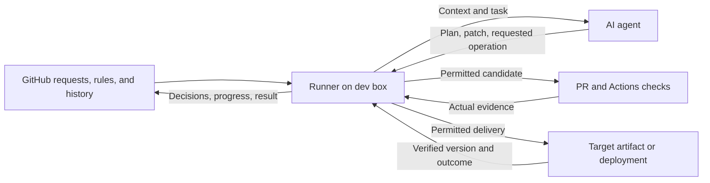
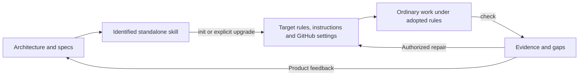
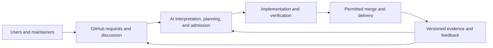
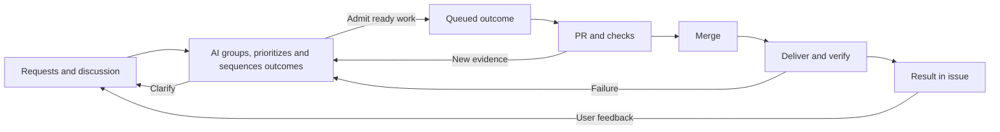

# YOLO Dev adopted protocol

Protocol format: `github-v1` · Candidate L1 distribution

Source: [4a199bde872fda89292ebf0924f59e971274d9c3](https://github.com/normzhou/yolo-dev/tree/4a199bde872fda89292ebf0924f59e971274d9c3). All required rules and procedures are below; upstream links are optional publisher context or tool documentation. The target supplies its own purpose and accepted authority, not YOLO Dev's Charter. Installing these rules does not qualify or authorize a target. L2 descriptions do not activate an unbuilt runner.

Source status notes describe the publisher at that revision, not this target's setup. This generated document preserves the design text; source links are rewritten to local sections wherever the referenced contract is included. The bundle's `provenance.json` records source digests and selections. Target adoption records retain this source identity and this file's digest.

## Contents

- [architecture](#architecture-adoption-levels)

- [operating-protocol](#operating-protocol-operating-protocol)

- [activities](#activities-agent-activities)

- [repo-layout](#repo-layout-repository-layout)

- [issue-management](#issue-management-issue-management)

- [repo-rules](#repo-rules-repository-rules-and-authority)

- [verification-delivery](#verification-delivery-verification-and-delivery)

- [releases](#releases-product-releases)

- [conformance-checks](#conformance-checks-conformance-checks)

- [qualification](#qualification-compliance-and-qualification-evidence)

- [adoption-records](#adoption-records-adoption-and-evidence-records)

- [github-workflow](#github-workflow-github-operating-workflow)

- [request-interface](#request-interface-request-to-result-interface)

- [onboarding](#onboarding-onboarding-and-check)

- [assisted-development](#assisted-development-assisted-distribution)

- [issue-delivery](#issue-delivery-issue-delivery-runner)

- [observation](#observation-activity-observation)


<a id="architecture-adoption-levels"></a>
### Adoption levels


| Level | Capability |
| --- | --- |
| L0 · Baseline | AI coding with your own workflow; no YOLO protocol. |
| L1 · Assisted | Maintainer-started harness sessions; AI aligns intent, code and progress through adopted rules/shared records. |
| L2 · Autopilot | Requests automatically reach verified delivery within the grant, without human code approval. |
| L3 · Self-directed | AI identifies useful improvements from use, feedback and maintenance evidence, then delivers them. |
| L4 · Living App | Your app engages users about needs/outcomes, closing use → work → improvement → feedback. |

Ownership does not change across levels; [qualification](#qualification-compliance-and-qualification-evidence) demonstrates capability for a target/revision/route. L1 provides procedural assurance; L2 adds enforced boundaries.

<a id="architecture-system-boundary"></a>
### System boundary

From L2:



AI plans and adapts; the [runner](#issue-delivery-issue-delivery-runner) reconciles context and enforces authority/evidence before operations. Begin on a user-controlled dev box with isolated workspaces and publishing privilege outside candidates. Actions handles automated CI/CD; targets supply delivery access.

GitHub/pushed Git hold durable state. Disposable sessions restart by reconciling existing effects, feedback and pause.

<a id="architecture-agent-interaction"></a>
#### Agent interaction

One repo installation exposes a shared `yolo` skill through [native harness bindings](#assisted-development-harness-bindings), with [init, upgrade, check, request, work, feedback and help](#activities-agent-activities). Bindings pass text to the same procedures; switching harnesses retains adopted rules and shared progress. L1's maintainer starts sessions; L2 automatically starts the same work procedure. Direct conversation steers through shared records; a bypass requires an explicit owner override.

<a id="architecture-request-surface-and-user-visible-delivery"></a>
#### Request surface and user-visible delivery

Users/maintainers discuss through issues/comments, optionally [inside the app](#request-interface-request-to-result-interface). AI manages interpretation/progress/results; UI shows records and actual availability without a parallel project database or app-side model.

<a id="architecture-dimensions-of-conformity"></a>
### Dimensions of conformity

| Dimension | Opinion | Contract |
| --- | --- | --- |
| Governing context | Separate intent, design and implementation; complete local rules and ordinary loading. | [Protocol](#operating-protocol-operating-protocol), [layout](#repo-layout-repository-layout) |
| Project management | Shared request intake routes to target/publisher; AI groups inputs into bounded outcomes and manages a recoverable plan, summaries and linked PRs. People steer/contest. | [Issues](#issue-management-issue-management), [workflow](#github-workflow-github-operating-workflow) |
| Authority | PRs with current authorization/evidence; protected approval, ordinary autonomy, identifiable overrides. | [Repo rules](#repo-rules-repository-rules-and-authority) |
| Delivery | Target-defined checks/routes; shared semantic release tags and immutable identities; verify actual delivered outcomes. | [Verification/delivery](#verification-delivery-verification-and-delivery), [releases](#releases-product-releases) |
| Evidence | Preserved identity, context, history and findings; cited capability. | [Records](#adoption-records-adoption-and-evidence-records), [qualification](#qualification-compliance-and-qualification-evidence) |
| Observation | Opt-in native activity records with truthful measurements, separate from work state, reports and feedback consent. | [Observation](#observation-activity-observation) |

Reserve `.yolo/` for governing context, adopted protocol, adoption record and optional reports. [Layout](#repo-layout-repository-layout) defines exact slots/mappings; app and native tooling keep useful conventions.

<a id="architecture-establishing-and-maintaining-conformity"></a>
### Establishing and maintaining conformity



[Init/check](#onboarding-onboarding-and-check) propose/apply setup and review ongoing work. The [standalone bundle](#assisted-development-assisted-distribution) carries enough information for another harness without upstream checkout/chat. The [check catalog](#conformance-checks-conformance-checks) separates deterministic requirements, advisory warnings and agent judgment. The shared validator checks facts; agents review purpose, authority and behavior. Init, upgrade and check converge on the same canonical structure, with dry-run proposals validated before activation. Ordinary loading and both forms of review sustain conformity; L2 also enforces execution preconditions.

Repair the lowest sufficient layer. Target defects stay there; YOLO defects feed back here. Setup, active preparedness and qualification are distinct evidence claims.

Keep product engineering separate from the reusable methodology. YOLO Dev validates its own tooling/bundle and harness behavior under [publisher acceptance](#assisted-development-acceptance); its concrete commands and CI status live in [development instructions](https://github.com/normzhou/yolo-dev/blob/4a199bde872fda89292ebf0924f59e971274d9c3/docs/development.md). Each adopted repo defines its own tests and delivery route under the shared [verification contract](#verification-delivery-verification-and-delivery). [Target qualification](#qualification-compliance-and-qualification-evidence) needs that target's actual delivery/continuation evidence; publisher tests cannot supply it.

<a id="architecture-product-source-and-applied-adoption"></a>
### Product source and applied adoption

**Charter → architecture/specs → implementation and published artifacts.**

One co-owned design layer defines shared opinions/acceptance; AI realizes them as skills, helpers, templates, tests and published rules. Targets supply their own purpose/grant. An installed skill and adopted snapshot have separate lifetimes; source/publication changes cannot silently upgrade a pin. YOLO self-use follows the same explicit adoption route.

<a id="architecture-document-homes"></a>
#### Document homes

| Home | Role |
| --- | --- |
| Charter | Human-owned intent/authority for this product. |
| Architecture/specs | Co-owned design/acceptance for protocol, onboarding, distribution and runner. |
| Implementation/artifacts | AI-maintained realizations. |
| README, AGENTS, brainstorm | Visitor explanation, agent entry and exploration/history; ownership follows meaning. |
| Target `.yolo/` and GitHub | Applied context, configuration, work and evidence. |


<a id="operating-protocol-operating-protocol"></a>
## Operating protocol

**The target supplies purpose; YOLO supplies coordinated progress toward it.** The [architecture](#architecture-adoption-levels) connects these contracts. They apply to every adopter, including YOLO Dev, under its own Charter and authority.

<a id="operating-protocol-responsibilities-and-ownership"></a>
### Responsibilities and ownership

| Surface | Responsibility and ownership |
| --- | --- |
| Charter and authority | Humans own purpose, guiding boundaries, recognized maintainers and delegation. [Protected edits](#repo-rules-repository-rules-and-authority) require identified approval or a scoped owner override. |
| Architecture/specs | Humans and AI co-own intended design, behavior and acceptance. Significant changes notify co-owners. |
| Implementation, tests, CI/CD | AI implements, verifies, delivers and maintains within the grant. |
| Issues/PRs | AI manages requests, plans, progress and evidence; input retains its author's authority. |
| Instructions and records | AI connects agents to governing context and records facts; these cannot grant permission. |
| README and exploration | Explain the product and preserve thinking. Neither replaces governing decisions. |

**Information flows both ways; authorization follows ownership.** Human intent guides work; user feedback and delivered results challenge assumptions. Correct the lowest sufficient layer without bypassing its owner.

<a id="operating-protocol-shared-loop-and-boundary"></a>
### Shared loop and boundary



Four obligations govern the loop:

| Obligation | Principle |
| --- | --- |
| Ownership | Read applicable intent, design, instructions and authority; act within the grant. |
| Congruence | Design serves purpose; code realizes intended behavior; tests verify it. Apply YAGNI: the simplest complete solution to an actual need. |
| Verification | Define observable acceptance; verify the actual revision and delivered outcome. Retain failures and limits. |
| Continuity | Keep decisions, evidence and next actions in GitHub/pushed Git; reconcile interrupted effects before retrying. |

AI chooses plans, alternatives and decomposition. Privileged operations require authority and current evidence, not an agent's success claim. See [merge](#repo-rules-repository-rules-and-authority), [delivery](#verification-delivery-verification-and-delivery) and [evidence](#qualification-compliance-and-qualification-evidence) for precise requirements.

<a id="operating-protocol-adoption-levels"></a>
### Adoption levels

[L0–L4](#architecture-adoption-levels) describe capability. L1 uses maintainer-started harness sessions with procedural assurance; L2 adds automatic initiation and enforced boundaries. Higher levels add initiative and app engagement without changing ownership.

<a id="operating-protocol-contracts-and-distribution"></a>
### Contracts and distribution

Keep each decision in one governing home: [layout](#repo-layout-repository-layout), [issues](#issue-management-issue-management), [repository rules](#repo-rules-repository-rules-and-authority), [delivery](#verification-delivery-verification-and-delivery), [records](#adoption-records-adoption-and-evidence-records), [observation](#observation-activity-observation) and [qualification](#qualification-compliance-and-qualification-evidence). [Activities](#activities-agent-activities) and [onboarding](#onboarding-onboarding-and-check) define interaction; the optional [app interface](#request-interface-request-to-result-interface) presents the same records.

Charter → architecture/specs → implementation and published artifacts. The [standalone bundle](#assisted-development-assisted-distribution) realizes these contracts without a second design tier. Targets adopt an identified revision under their own authority; publisher changes cannot silently upgrade it.


<a id="activities-agent-activities"></a>
## Agent activities

**Talk through your harness; coordinate through GitHub.** One skill exposes procedures through the [harness bindings](#assisted-development-harness-bindings), not separate applications or required shell commands. Use the target's active [protocol](#operating-protocol-operating-protocol) and grant; clarify only ambiguous destination or execution scope. Status queries are read-only.

| Activity | Destination | Result |
| --- | --- | --- |
| `init [preview\|ref]` | Target | Propose/apply [adoption](#onboarding-onboarding-and-check); `--dry-run` retains a local preview. |
| `upgrade [preview\|ref]` | Target | Propose migration to latest stable, latest preview or an explicit publication; `--dry-run` previews. |
| `check` | Target | Read-only conformity review, then optional upstream feedback; `--dry-run` proposes isolated repair under the same pin. |
| `request` | Target | Discuss, file or follow an app need or question. |
| `work` | Target | Advance issue-backed outcomes through verified delivery. |
| `feedback` | YOLO Dev | Discuss, submit or follow an upstream problem or improvement. |
| `help [activity]` | Local | Show supported activities, invocation examples and target/upstream distinction; no setup, execution or external submission. |

Work requires active adoption; otherwise prepare init. Feedback needs only installed publisher provenance and reporting authority. An activity absent from an older pin is a capability gap, not permission to upgrade it.

<a id="activities-help-concise-usage"></a>
### Help: concise usage

Bare invocation, `help` without a question and unknown activities return the skill's fixed usage text verbatim. It lists activities and distinguishes target requests from upstream feedback, without inspecting the repo or claiming adoption/qualification. `help <activity>` gives a short paragraph and relevant local reference; expand only to answer a specific question. Help performs no setup, work or external submission.

<a id="activities-request-target-intake"></a>
### Request: target intake

Search related issues, discuss the need, and file/update when authorized. Quick answers need no ticket unless tracking is wanted. Return an actual link or an unsent draft/access gap.

Apply the shared [intake model](#issue-management-intake-and-admission), also used by upstream feedback: classify with an existing `yolo:request` label when authorized; the receiving AI handles missing classification. Explain interpretation/disposition and covering outcomes without mechanical ticket duplication. Request does not start implementation unless execution is requested or standing authority permits it. Follow-up and roadmap questions use the same records.

<a id="activities-work-shared-development-procedure"></a>
### Work: shared development procedure

Accept an issue, desired outcome or direction to continue the plan. Capture the outcome in a target issue before implementation.

1. **Reconcile:** load instructions, active rules, mapped intent/design/grant and shared work. Check replies, PRs, checks, delivery, pause and executor/handoff; resolve interrupted effects and coordinate writers.
2. **Plan/admit:** perform the [planning pass across requests/outcomes](#issue-management-planning-across-outcomes), define acceptance and select ready work within scope. Record grouping, priority/dependencies and a discoverable Now/Next when coordination spans outcomes. Apply protected-change approval/significance notification rules.
3. **Execute:** maintain issue state/summary, implement through [PRs](#repo-rules-repository-rules-and-authority), verify and [deliver](#verification-delivery-verification-and-delivery). Replan when evidence changes.
4. **Record/continue or hand off:** publish actual version, outcome, limits and next action; close fulfilled work only after verification. Preserve unfinished pushed work and truthful state. Continue within scope; a session ending does not prove its executor stopped.

Ordinary development requests enter this procedure without naming the skill. Conversation is steering; bypass requires a scoped [owner override](#repo-rules-owner-overrides).

L1's maintainer starts sessions; AI may admit and plan within them. Between sessions there is no independent YOLO intake/scheduling, though started CI/CD may continue. L2's [runner](#issue-delivery-issue-delivery-runner) initiates this same procedure with enforced preconditions.

<a id="activities-observation-automatic-activity-records"></a>
### Observation: automatic activity records

An opted-in and natively bound harness may [observe](#observation-activity-observation) an explicit activity's execution automatically: correlated `started`/`finished` events with native measurements and an allowlisted projection of the ordinary report. Observation is separate from feedback consent, defaults off, observes without adding prompts or gates, and never replaces the report, advances a checkpoint or qualifies the adoption. An activity absent from a pin that lacks an observer remains a coverage gap, not permission to upgrade it. Dry runs and non-consenting repositories emit nothing.

<a id="activities-feedback-upstream-yolo-interaction"></a>
### Feedback: upstream YOLO interaction

Resolve upstream from adoption/bundle publisher provenance; never default to the target's origin. Search related issues/plan and prefer existing threads. Keep target requests in the target repo.

This is a request to the publisher: use the same intake classification and receiver-managed planning, not a separate feedback queue. Apply an existing `yolo:request` label when authorized and available; otherwise file normally and leave classification to the receiver. Never configure the upstream repository from a target harness.

Draft useful bugs, questions or improvements arising from actual use of YOLO: unclear, conflicting or ineffective guidance, tooling failures or unnecessary friction. During check and the final init/upgrade assessment, briefly consider these causes; ordinary target defects and successful checks need no upstream report. Separate observed evidence from hypotheses.

**Default: draft → show destination/content → ask the harness user → submit if authorized.** Group the same cause in one issue; search before filing, reuse related threads and add only substantive new evidence. Sanitize before showing or sending: exclude target identities, code, URLs, paths, raw logs and credentials. Include only YOLO release, relevant harness/activity, expected versus observed behavior, impact and a safe reproduction when available.

An active target may opt into automatic submission through its [adoption record](#adoption-records-adoption-and-evidence-records). A recognized maintainer must explicitly accept that scope at an identified revision; the flag alone grants nothing. Check the active pin, accepted consent and governing restrictions before using it. This permits only the sanitized feedback above to the provenance-identified publisher, never broader telemetry or target disclosure. Without valid consent, retain drafts and ask. **Dry runs never submit**, regardless of the setting.

Keep assessment read-only; any authorized submission is a separate, visible feedback step. Confirm its actual issue/comment link, or retain an unsent draft with the access gap. Submission implies no admission or ETA; upstream fixes require explicit target upgrade and unavailable access does not block unrelated work.

<a id="activities-acceptance"></a>
### Acceptance

Demonstrate the activities from a standalone bundle: read-only help/status, shared intake without premature admission, multi-request grouping/sequencing with durable planning and source coverage, direct harness work with fresh continuation, and upstream routing with default consent, accepted automatic opt-in, draft-only dry runs and no unauthorized submission/disclosure. Use [qualification](#qualification-compliance-and-qualification-evidence) for level claims.


<a id="repo-layout-repository-layout"></a>
## Repository layout

**Reserve `.yolo/`; preserve useful app and native tooling layouts.** This defines the compliant state; [onboarding](#onboarding-onboarding-and-check) reaches it.

```text
.yolo/
  governance/
    CHARTER.md
    AUTHORITY.md
    ARCHITECTURE.md
    specs/          # Optional durable behavior contracts
  protocol.md
  adoption.json
  reports/          # Optional file-based evidence/proposals
```

| Surface | Meaning |
| --- | --- |
| Charter | Human-owned purpose, goals and durable guiding boundaries. |
| Authority | Human-owned recognized maintainers, delegation, reserved decisions and limits. |
| Architecture/specs | Co-owned intended design, behavior and verification/delivery route. |
| Protocol | Complete locally available rules at an explicitly adopted source revision. |
| Adoption | AI-maintained identity, mappings, status and history/evidence references; see [records](#adoption-records-adoption-and-evidence-records). |
| Reports | AI-maintained evidence/proposals, including unresolved questions; issues/PRs remain the primary work interface. |

<a id="repo-layout-reserved-namespace"></a>
### Reserved namespace

Names and types are exact and case-sensitive. Only the tree's entries are allowed inside `.yolo/`; names/subdirectories within specs/reports are target-defined. Create optional directories only for content. App code, installed skills, caches, credentials, parallel issue databases and ephemeral [observation](#observation-activity-observation) counters/correlation stay out.

All three governing documents use the canonical slots above; durable governing specs use `.yolo/governance/specs/`. Existing documents are migration inputs, not permanent location exemptions. Preserve their accepted meaning while moving them, update active references and native tooling that depends on those paths, and remove competing active copies. Active governing/instruction links must agree with those mappings; migration is a move, not a parallel document tier. Historical evidence retains its original content and cited revision. Earlier pins keep their earlier rules until an explicit upgrade.

Questions belong in reports/issues, not extra governing files. Ownership follows meaning, including draft Charter/authority and proposed controls; location cannot grant permission.

The adopted source revision identifies the layout contract. The [schema](https://github.com/normzhou/yolo-dev/blob/4a199bde872fda89292ebf0924f59e971274d9c3/specs/repo-layout.schema.json) supplies its reserved entries/types/role paths in the manifest. The strict validator reports missing canonical homes, unexpected entries, wrong types and invalid mappings without changing files. Init/upgrade propose the required repair; do not mark setup prepared while required structure fails. An incompatible/missing definition is a coverage gap; structural success does not prove meaning or approval.

<a id="repo-layout-governing-file-review"></a>
### Governing-file review

Check each canonical governing slot independently: exact spelling, regular non-symlink file, nonempty content and matching role mapping. Then inventory files with the same basename (case-insensitive) elsewhere using Git's tracked and unignored working files. Ignored untracked dependencies/builds and nested repos are outside this scan; tracked artifacts still count. Report candidate path, canonical role, file/symlink type and byte equality when safely readable. Never follow a candidate symlink outside the repo.

Filename or byte equality is a **review signal**, not a ban or deletion instruction. Before completing init/upgrade/check review, classify every candidate with content/reference/history evidence: unintended active replica, intentional non-governing template/fixture/history/distinct scope, or unresolved. Preserve intentional artifacts; reconcile replicas through an authorized move and reference/tooling repair. Unknown purpose stays unresolved. Record classifications in the normal report; no permanent allowlist is required.

Review ordinary entrypoints and README too. Calling this repo's own Charter/design “publisher source” does not establish an independent role or justify copies that may drift. Reusable methodology implementation and installed rules remain separate artifacts; this distinction cannot create two governing homes for the same decision. Use [the consistency checklist](#onboarding-proposal-review); structural success cannot clear semantic candidates.

<a id="repo-layout-native-entrypoints-and-ordinary-context"></a>
### Native entrypoints and ordinary context

Keep source, tests, assets, builds and package entrypoints in useful target locations. Keep harness/GitHub entrypoints native, such as `AGENTS.md`, `.agents/skills/` and `.github/workflows/`; the [shared bundle and command bindings](#assisted-development-harness-bindings) stay outside `.yolo/`. Preserve other active instructions. README links the governing documents.

Ordinary instructions require agents to read/apply the local protocol, adoption and mapped context before work, even without invoking the skill. Harness-specific bridges expose that same context, not independently authored rules.

<a id="repo-layout-integrity-and-continuity"></a>
### Integrity and continuity

Rules must work without upstream checkout, prior chat or live fetch. The local snapshot has a committed source identity, digest and working local references. Skill replacement/removal cannot alter the pin; upgrades/history preservation follow [records](#adoption-records-adoption-and-evidence-records) and [onboarding](#onboarding-repeat-init-and-upgrade). Existing `.yolo-dev/` installations retain their pin until explicit migration.

File presence is only one dimension of [qualification](#qualification-compliance-and-qualification-evidence); issues, effective repository settings and actual delivery also require review.


<a id="issue-management-issue-management"></a>
## Issue management

**People describe needs; AI manages work.** Product requests, CI/CD and maintenance share GitHub issues/PRs.

Issue policy: `request-outcome-v1`.

<a id="issue-management-intake-and-admission"></a>
### Intake and admission

Target `request` and upstream `feedback` use the same intake model in different receiving repositories. Their routing, consent and authority remain distinct. AI classifies incoming needs/questions/evidence with `yolo:request`, including unlabelled issues and substantive new replies. Authorized submitters may apply an existing label; missing label permissions do not block filing or authorize repository configuration changes.

Intake is not admission. AI interprets requests and records disposition before queuing outcomes. Several requests may inform one bounded outcome; one request may require several. Promote a source issue in place when it already expresses that outcome, retaining `yolo:request`; otherwise link sources to covering work. One `yolo:work` issue represents one outcome and may have several PRs. Do not create a second ticket mechanically or group unrelated work merely by arrival time.

Before admission, maintain at most one summary comment headed `## YOLO request`: interpretation, decision/reason, covered and remaining scope with outcome links, and next action or reconsideration condition. No summary means awaiting triage, not scheduled work. After promotion, use the work summary for current status and preserve earlier triage as history. AI verifies authorship/content; a heading proves neither review nor authority.

Keep distinct source requests open while their promised scope is unfinished. Close verified fulfilled scope as completed, or duplicate/declined/answered input with an explicit disposition and canonical links where applicable. Consolidation, a plan or a merged PR does not prove delivery. Read later replies, including closed issues, and reopen or link follow-up without erasing earlier results.

<a id="issue-management-reserved-labels-and-states"></a>
### Reserved labels and states

Preserve unrelated labels. AI maintains:

| Label | Meaning |
| --- | --- |
| `yolo:request` | Incoming need, question or evidence; no execution commitment. Retained when promoted or closed. |
| `yolo:work` | Admitted AI-managed outcome with acceptance, progress and evidence. |
| `yolo:state:queued` | Ready and authorized, with clear acceptance/next action. |
| `yolo:state:active` | Work underway, including diagnosis, recovery or replanning. |
| `yolo:state:waiting` | Named dependency, information/authority gap, pause or binding limit blocks progress. |
| `yolo:state:deferred` | Postponed with a reason and reconsideration condition. |

After reconciliation, open managed work has exactly one state; closed work retains `yolo:work` and no state. Requests without `yolo:work` have no execution state. AI-originated maintenance outcomes need no invented source request. Planning/general conversations need no request or work label. Interrupted metadata updates establish neither permission nor completion.

Filter intake with `is:issue is:open label:"yolo:request" -label:"yolo:work"`; it includes reviewed sources tracked by other outcomes. Review summaries/replies to distinguish new input. Filter admitted work with `is:issue is:open label:"yolo:work"` and a state label. Build/test/deploy stages need no additional labels.

Init/upgrade establish this version's required labels. Earlier pins retain earlier requirements; a request label alone supplies no new authority or workflow state.

<a id="issue-management-planning-across-outcomes"></a>
### Planning across outcomes

At work startup and material changes, reconcile active execution/results, incoming requests/replies, dependencies and maintainer steering. Consolidate evidence, define useful bounded outcomes, select authorized work and explain ordering using Charter value, impact, risk, uncertainty, dependencies and effort. Frequency is evidence, not authority; no fixed scoring algorithm or oldest-first rule is required. Ask about consequential missing direction; use AI judgement for ordinary reversible choices.

For one outcome its status summary suffices. When coordination spans outcomes, maintain one discoverable planning issue linked from affected work/request summaries; reuse the L2 control issue when applicable. Its current summary records focus, ordered **Now / Next**, reasons, blockers and material changes. Work issues own execution state/evidence; do not duplicate them or create a mandatory board, roadmap file or approval cycle. Queue order is not an ETA.

Replan after failures, discoveries or changed steering; preserve earlier intent/failure and coordinate interruptions under the execution protocol. Advance independent ready work while blocked, explain deferral and reconsideration, and revisit neglected input. L1 planning occurs in maintainer-started sessions; L2 may initiate it automatically. Neither receipt nor a label guarantees admission or a response time.

<a id="issue-management-progress-planning-and-feedback"></a>
### Progress, planning, and feedback

Maintain one summary comment per outcome, headed `## YOLO status`:

```text
Outcome: intended result and source links
Acceptance: observable success
Plan / next: approach, blocker or reconsideration condition
Work: executor/attempt, branch/PR, revision and stage
Evidence / result: checks, delivered version/destination, user action and limits
```

Edit that same comment as work progresses; ordinary dated comments retain decisions/history without the status heading. Reconcile its executor, branch/PR, stage and next action with actual records when those change. An old issue body or superseded comment is not the current plan.

Mark unknowns. A heading or user success claim is not execution evidence. Dated comments preserve material decisions, changed scope/priority, failures, handoffs and results. Reply at source requests; explain declined/deferred scope and link release updates to verified versions. Split requests summarize delivered, remaining and declined outcomes.

Use native sub-issues/dependencies for actual decomposition/blocking. Update source requests for changed disposition/coverage and verified results; routine execution detail stays on linked work. Forecasts need supporting evidence and uncertainty.

<a id="issue-management-l2-coordination-and-recovery"></a>
### L2 coordination and recovery

L2 adds one open `yolo:control` issue, linked by adoption: Now/Next, Run/Pause and authenticated steering/handoff links. This is the only extra L2 label. Human pause lasts until explicit human resume.

Start with one coordinator and one writer per outcome. Record executor and acknowledged handoff before overlapping writes; labels, assignees or inactivity do not prove termination. Harness intervention uses the same protocol. Reconcile shared GitHub/Git/check/delivery state after interruption; no runner-side durable queue or cross-object transaction is required.

Retry only with new evidence or justified transient cause; otherwise reassess. AI may repair, change approach, replan, wait/defer or propose governing changes. Preserve prior intent and failure; explain revised acceptance prospectively at the source. No universal retry count is imposed; binding limits survive restarts and split work. [Delivery](#verification-delivery-verification-and-delivery) defines completion/recovery evidence.


<a id="repo-rules-repository-rules-and-authority"></a>
## Repository rules and authority

**Ordinary work uses PRs; authorization follows ownership.** Accepted owner/team policy identifies recognized maintainers. GitHub identity/permissions support it; a role, label or AI summary cannot expand the grant.

<a id="repo-rules-changes-and-merge"></a>
### Changes and merge

| Change | Rule |
| --- | --- |
| Charter, authority or authority controls | All edits need authenticated human approval of the proposed revision or a scoped owner override. |
| Architecture/specs | AI reviews congruence/significance. Shared behavior, boundaries, adoption requirements or delivery guarantees notify mapped co-owners with impact before merge and again at landing; no acknowledgement wait within the grant. |
| Implementation, tests, CI/CD | AI owns routine decisions/delivery within bounds; no human code-review gate. |

Every ordinary change uses a PR referencing its outcome issue. Use `Refs #42` while delivery is pending; merging must not close undelivered work. One outcome may span PRs.

Before merge, reconcile exact head/base, feedback/pause, accepted authority, correctness/congruence/significance review and [required checks](#verification-delivery-verification-and-delivery). Failed, missing, unknown or stale required evidence blocks the action.

Approval binds to the current proposed revision; further edits invalidate it. Accepted base policy identifies approvers: candidates cannot add an approver, expand their grant or certify their own authority gate. Historical cosmetic exceptions apply until an authorized upgrade; publisher text cannot amend a target Charter.

The grant, Charter and adopted protocol must agree about each affected action. Conflicting delegation/reservation or a local exception to the active rules blocks that action until recognized clarification, amendment or a scoped override; AI judgement cannot resolve it by choosing the more permissive text.

<a id="repo-rules-enforcement-by-level"></a>
### Enforcement by level

L1 requires procedural conformity and cited evidence. L2 additionally proves effective controls for PR routing, required evidence and protected approval. Automation has a distinct identity, no authority-administration or bypass privilege.

Prefer native GitHub rules/permissions. Record each enforcement binding and gap; files or declared settings cannot prove refusal. Selective approval remains to be demonstrated before L2; blanket human review defeats ordinary autonomous delivery. No particular ruleset, branch, merge strategy or approval bot is prescribed.

<a id="repo-rules-owner-overrides"></a>
### Owner overrides

Record authenticated owner, reason, affected rule, scope and revision in an issue/PR; link landed history with `YOLO-Override: #N`. Prefer PRs. Emergency direct actions retain equivalent evidence and old/new tips. Check matches action to scope; unexplained bypass is a finding.

AI maintains configuration within the grant. Authority-control changes retain human ownership regardless of file location; installation cannot supply bypass or publication privilege.


<a id="verification-delivery-verification-and-delivery"></a>
## Verification and delivery

**Verify the delivered outcome, not just the work that produced it.** Target architecture/specs define proportionate checks, destination/version observation, recovery scope and binding limits. AI owns testing, CI/CD and maintenance within that grant; no universal suite, service or retry budget is imposed.

This reusable contract governs evidence and delivery, not test implementations. Each target chooses its suites, build commands and workflows; it does not inherit YOLO Dev's own bundle tests or release tooling.

<a id="verification-delivery-checks-and-github-actions"></a>
### Checks and GitHub Actions

Record candidate/relevant base, acceptance, check source, actual runs/results and limits. Required evidence must pass on the current subject before dependent merge/delivery; failed, missing, unknown or stale evidence blocks it.

Use GitHub Actions for automated CI/CD, retaining useful workflows. L1 may use cited harness-run checks; L2 needs trustworthy automated evidence and effective controls. Do not add placeholder jobs. AI may improve verification, but evaluate replacements under incumbent accepted requirements before activation. Candidate tests/reports cannot replace the authority gate.

<a id="verification-delivery-delivery-and-completion"></a>
### Delivery and completion

Follow the shared [release convention](#releases-product-releases): semantic release tags, immutable identity, mapped native versions and preserved migration history. Targets choose their release tooling and cadence within authority.

Record revision/action/destination intent before merge/publication and actual results afterward in native PR/check/release/deployment records and issue summaries. Reconcile uncertain effects before retrying or dependent actions.

| Evidence | Establishes |
| --- | --- |
| Passing checks | Identified checks passed on their subject, within stated limits. |
| Merged PR | Code reached the target branch. |
| Artifact/deployment | An identified version reached a destination. |
| Verified outcome | Acceptance passed on that delivered version/destination. |
| Current availability | The relevant app/client currently serves it, supported by current version evidence. |

Close fulfilled work only after delivered verification. Link version/destination, acceptance, access/update steps and limits; release updates identify the verified version. App interfaces follow the optional [interface contract](#request-interface-request-to-result-interface).

Use the outcome's declared delivery route: verification in a development checkout does not establish availability through an advertised package, tag or deployment. A local checkout can itself be the agreed destination; state that scope explicitly. Otherwise keep work open through publication and verification of the version users obtain.

<a id="verification-delivery-failure-and-maintenance"></a>
### Failure and maintenance

Use the [adaptive work loop](#issue-management-l2-coordination-and-recovery): diagnose, recover/change approach, replan, wait/defer or propose governing changes. Keep work active while authorized progress is possible; waiting names a real constraint. Separate issues serve independent outcomes.

Retain prior intent/failures; revised acceptance is prospective. Recovery cannot expand authority. Reconcile rollback/current availability without erasing historical delivery. Pause and binding limits survive restart.


<a id="releases-product-releases"></a>
## Product releases

**Every YOLO-enabled product uses immutable `vMAJOR.MINOR.PATCH` release tags.** Optional [SemVer](https://semver.org/) prereleases, such as `v0.2.0-alpha.1`, are allowed; native app/package versions omit `v`.

Target architecture/specs define the compatibility promise, native version source and delivery route. Stable releases increment major for incompatible changes, minor for compatible capabilities, patch for compatible fixes. Before 1.0 compatibility is experimental; breaking changes still explain migration. AI chooses cadence and bumps within its grant; changing the major version supplies no additional authority.

Published tags and contents are immutable. Corrections use new versions. Record tag, full commit, delivered artifact/destination, verified acceptance and update/migration steps; rollback identifies the restored version. A tag proves neither delivery nor current availability. Changes may be batched; commits/deployment attempts retain their own identities. Reuse native version files and delivery records, without an extra reserved file or mandatory per-deployment GitHub Release.

At release, the native version at the tagged revision and in the delivered artifact must match the tag. HEAD may carry an unreleased version; changing it cannot repair an already-published mismatch. Preserve that discrepancy and prepare a consistent next unused version, publishing only when verification and authority permit.

<a id="releases-establish-and-check"></a>
### Establish and check

Init proposes the smallest release-policy/version-source migration. AI selects the existing native source where suitable; this routine binding does not require a new human decision. Preserve existing compatible versions; default new products to `0.1.0-alpha.1`. Record when the adopted convention became applicable and the exact earlier product tags/commits; those retain their earlier rules, including any existing target policy. An older mention of versioning cannot backdate newly adopted requirements. Later migrations preserve established boundaries and identify new requirements in their upgrade evidence. Every subsequent product release conforms. Other tooling tags can coexist, with their purpose reviewed.

Unreleased projects declare their initial version and unreleased status. Prepared setup requires mapped policy and a valid native version; do not manufacture publication. Q4 demonstrates tagged, verified release when product publication is in scope. Local-checkout-only delivery remains explicitly scoped.

Explicit upgrades reconcile the same policy, releases and history in their migration. Updating the YOLO installation alone does not bump the target product. Dry runs create no remote tags/releases; publication remains within existing authority.

Read-only check reviews default-branch setup, current release records and the interval since effective adoption/checkpoint. Factual checks observe names, tag/commit mappings and changes to retained observations. AI verifies native versions, artifact identity, compatibility bumps, migration and delivery. Persist dated tag/commit observations in ordinary evidence records; current refs cannot prove historical immutability. Missing evidence stays unverified; violations need cited resolution, not rewritten tags/history.

The [record encoding](https://github.com/normzhou/yolo-dev/blob/4a199bde872fda89292ebf0924f59e971274d9c3/skills/yolo/references/records.md) realizes these bindings. Target product versions and adopted YOLO releases are independent; upstream publication never upgrades a target automatically.


<a id="conformance-checks-conformance-checks"></a>
## Conformance checks

**Programs check facts; agents judge meaning. Both are required.** This reusable catalog applies under the target's adopted version. Linked contracts define the details.

<a id="conformance-checks-deterministic-checks"></a>
### Deterministic checks

The read-only validator implements these tests. Deterministic violations cannot be waived; missing observations remain unverified. L1 is procedural: a check is not an enforced merge gate. [L2 controls](#repo-rules-enforcement-by-level) require separate evidence.

| Check | Required fact |
| --- | --- |
| [Layout](#repo-layout-repository-layout) | One active adoption marker; exact reserved slots/types; nonempty mapped governing documents; specs in their canonical home; no unexpected reserved entries or escaping paths. |
| [Rule identity](#assisted-development-information-delivery) | Snapshot, provenance, manifest and complete skill inventory match recorded digests/publication bindings. |
| [Agent entrypoints](#assisted-development-harness-bindings) | Native bindings/imports are intact; instructions reference local adoption/protocol; checked governing Markdown links resolve to mapped homes. |
| [Record encoding](#adoption-records-adoption-and-evidence-records) | Required context/migration fields and references have valid shape; feedback settings are boolean with consent references when enabled. |
| [History](#adoption-records-reports-and-checkpoints) | Baseline/checkpoint ancestry, report chain and interval identities agree; recorded unresolved findings prevent factual readiness; checkpoint/report history remains intact. |
| [Issues](#issue-management-reserved-labels-and-states) | Adopted-policy labels exist; request classification is not admission; states require `yolo:work`; managed open issues have one state, closed issues none; each outcome has one status summary, each classified request at most one request summary. |
| [Releases](#releases-establish-and-check) | Release bindings/effective history exist; product-tag candidates follow naming rules; published releases have tags; retained tag/commit observations remain unchanged. |
| [Default branch](#qualification-required-observations) | Declared branch matches GitHub; landed adoption identity agrees with inspected setup. Unavailable/unpublished context remains unverified. |

`--structure` covers local layout, identity, entrypoints and structural encoding. Full check adds context/history and GitHub facts; offline leaves remote checks unverified. Earlier pins retain their coverage. Findings: `compliant/missing/conflicting/unverified`. Structure: `pass/fail/unverified`. Exits: 0 ready for review, 1 gaps, 2 invocation/Git error.

The validator observes repository settings; it does **not** authenticate approval/provenance, judge document/report/summary contents, inspect every PR review/check, validate native versions, execute target tests or prove delivery. Agents reconcile that evidence.

The publication manifest identifies `issue_management: request-outcome-v1`. Only that adopted policy requires `yolo:request`; older pins retain their label requirements. The classifier may coexist with older rules without granting execution. Zero request summaries means awaiting triage, not a deterministic failure; identifying unlabelled input, review/disposition quality, coverage, plan discoverability and sensible ordering require agent judgment.

<a id="conformance-checks-advisory-warnings"></a>
### Advisory warnings

Matching-name governing files are **review candidates**, not automatic violations. `replica_candidates` provides paths/type/byte comparison. Candidates alone do not fail structural checks; an incomplete inventory is unverified.

Classify each from content/references/history: active duplicate, intentional template/fixture/history/distinct scope, or unresolved. Record evidence and an authorized next action. Preserve intentional artifacts; never delete or exempt by filename alone. Confirmed active duplication fails conformance; unresolved required review prevents a conformance claim.

Flag other ambiguity for judgment. Warnings cannot waive an underlying requirement.

<a id="conformance-checks-agent-judgment"></a>
### Agent judgment

Record **pass / fail / unverified, evidence and next action** for each review:

| Review | Question |
| --- | --- |
| Purpose and congruence | Do all layers serve confirmed goals, with concise documents, one governing home and correct active references? |
| Ownership and authority | Do grant, Charter and pin agree? Are approvals authentic/revision-bound, significant changes notified and overrides scoped? |
| Work and adaptation | Are intake and committed outcomes distinct, with justified grouping, source coverage and recoverable Now/Next/dependencies? Do replies, actual progress, closures and replanning remain truthful, including neglected input and failures? |
| Verification and delivery | Are checks trustworthy/current, versions and compatibility justified, and outcomes verified on the actual delivered artifact? |
| Continuity | Does full history preserve decisions/failures, including repaired violations, and support recovery without hidden session state? |
| Capability | Was loading/fresh continuation observed? Does the claimed level satisfy [qualification](#qualification-compliance-and-qualification-evidence), including effective L2 controls? |

Init, upgrade and standalone check use this same boundary and the [proposal checklist](#onboarding-proposal-review). A structural pass or exit 0 opens review; neither establishes authorization, activation or qualification.


<a id="qualification-compliance-and-qualification-evidence"></a>
## Compliance and qualification evidence

**Configured is not qualified.** Compliance means following the adopted rules; qualification demonstrates capability for an identified target, protocol, revisions, harness/runtime and delivery route. Missing, inaccessible, stale or conflicting required evidence stays unverified.

<a id="qualification-required-observations"></a>
### Required observations

The [check catalog](#conformance-checks-conformance-checks) defines deterministic coverage, advisory warnings and required agent judgment.

| Contract | Inspect |
| --- | --- |
| [Layout](#repo-layout-repository-layout) | Intact local rules, mapped context/grant, native bindings/ordinary loading, baseline, applicability and evidence references. |
| [Issues](#issue-management-issue-management) | Labels, states/closures, summaries, source/PR links, plan/decisions, replies including closed issues; L2 control/handoff. |
| [Repository rules](#repo-rules-repository-rules-and-authority) | Current branch/PR/history, effective settings, recognized identity, revision-specific approval, notifications, overrides and action authority. |
| [Delivery](#verification-delivery-verification-and-delivery), [releases](#releases-product-releases) | Declared checks/routes/native version, release naming and immutable identities, actual delivery/acceptance and relevant availability; legacy applicability and unreleased setup remain explicit. |

Reconcile current default-branch state, local changes, every intervening commit since baseline/checkpoint, and GitHub records/configuration. Investigate intermediate violations even when repaired.

Known, verified platform capability limits are L1 context, not enforcement evidence. Unknown permission denials remain gaps; L2 cannot waive required controls because a feature is unavailable.

<a id="qualification-durable-evidence"></a>
### Durable evidence

Factual tools only collect observations. AI reviews [ownership, congruence, verification and continuity](#operating-protocol-shared-loop-and-boundary), diagnoses cause/impact and cites findings/resolutions. Repair the lowest sufficient layer within authority.

Use [records/checkpoints](#adoption-records-reports-and-checkpoints) for subject identity, complete history, published evidence and preserved failures. Qualification adds actual harness/version and a verdict, reason and source for every criterion. If qualification was unsupported, retain its evidence and reassess; only active prepared setup can retain prepared status.

Reconcile narrative claims with primary records, including subject IDs and event/completion times. Distinguish an action's actual result from what its executor had verified at decision time. Correct mistaken reports with cited evidence, preserving the earlier claim. Merely recording a required deviation does not resolve it or make conformance pass.

<a id="qualification-l1-acceptance"></a>
### L1 acceptance

| ID | Pass requires |
| --- | --- |
| Q1 · Portable setup | Intact identified local rules; mapped governing context/authority; normal instruction loading; required labels; preserved baseline. No upstream checkout or unresolved required template/context gap. |
| Q2 · Authorized task | Real outcome issue with interpreted need, applicable grant, observable acceptance, decisions/steering and significance notifications. |
| Q3 · Conformance | Cited review of all four obligations, current setup/work, every intervening commit and relevant GitHub records under applicable versions. Required findings have cited resolutions; repaired history remains visible. |
| Q4 · Verified publication | Acceptance passes on the identified authorized delivered result. Distinguish inspected, merged, published/deployed and later bookkeeping revisions; retain limits. |
| Q5 · Fresh continuation | Fresh authorized session loads normal instructions/local rules, reconciles shared work and performs or identifies the correct next action without settled-intent rebriefing. Cite harness/version and loading evidence. |

All Q1–Q5 must pass with no unresolved required finding. A marker, skill installation or factual exit success cannot substitute for this evidence. Qualification applies only to its inspected scope.

A fresh session may record its own observed loading and continuation: identify the harness/version, distinguish it from the setup or upgrade session, and cite loaded context and reconciled actions. It cannot attest a future restart or unobserved session. When observed during read-only `check`, present the evidence and the next recording action; [authorized work](#activities-work-shared-development-procedure) may publish it in that same fresh session or a later one. Recording facts needs existing write authority, not a new grant or another fresh session. Publish the report before recording a successful checkpoint, and assess all criteria separately.

<a id="qualification-l2-acceptance"></a>
### L2 acceptance

Additionally demonstrate automatic intake through verified delivery; refusal of unauthorized protected actions while ordinary code proceeds without human approval; authenticated pause/resume and acknowledged handoff; and recovery after workspace/session loss or interruption between an external effect and bookkeeping.

Reconcile changed feedback, authority and actual outcomes before proceeding. Activation requires demonstrated controls and authorized delivery/recovery. L3/L4 need their own capability evidence when built; no higher level is implied.


<a id="adoption-records-adoption-and-evidence-records"></a>
## Adoption and evidence records

**Records identify context and evidence; they cannot grant authority.** The bundle defines versioned encoding for these semantics. New records use `.yolo/adoption.json`; migration is explicit.

<a id="adoption-records-adoption-record"></a>
### Adoption record

| Field responsibility | Required meaning |
| --- | --- |
| Format/protocol | Supported versions; publisher/source repository, full committed source revision, inputs or manifest reference, local snapshot path and SHA-256. Input identity does not imply generated output existed at that revision. |
| Target | GitHub repository, observed default branch, scope and requested level; remote names convey no permission. |
| Governing context | Repo-relative Charter, authority, architecture, ordinary instructions and applicable specs; follow [layout mappings](#repo-layout-repository-layout). Paths stay inside the target. |
| Authority | Recognized maintainers/accepted source, identified grant/bootstrap acceptance and pending conflicts. |
| Native bindings | Harness/version, loading route and installed skill identity/location or explicit gap. |
| Verification/delivery | References to checks, destination/version observation, release policy/native version source/effective revision and preserved tag/commit evidence, accepted recovery/limits and optional app interface. Do not duplicate the grant or workflow state. |
| Feedback | Optional automatic sanitized upstream reporting, disabled when absent. Record explicit recognized-maintainer consent; preserve the choice across upgrades without broadening its scope. Changes are authority controls, not ordinary setup facts. |
| Observation | Optional [activity observation](#observation-activity-observation), disabled when absent, with a stable opaque adoption identity. Consent is separate from feedback, retained across init/upgrade/worktrees; disabling stops future transmission. Changes are authority controls, not ordinary setup facts. |
| Activation | Proposed or active; active requires accepted governing decisions and installed identified context. |
| History/status | Original baseline, effective upgrades, successful checkpoint/report, unresolved references and level evidence. |

Use full commit IDs, stable GitHub references and repo-relative paths. Unknowns/unsupported versions are gaps. Preserve baseline, prior applicability, findings and reports across repeat init, relocation or upgrade.

| Qualification status | Evidence |
| --- | --- |
| Unverified | Proposed/incomplete adoption or insufficient required evidence. Proposed activation stays unverified. |
| Prepared | Accepted active setup observed on the default branch; real-task/continuation evidence may remain pending. |
| Qualified | The [level criteria](#qualification-compliance-and-qualification-evidence) pass with cited evidence. |

Pending acceptance is a readiness gap, not malformedness. A summary cannot authenticate approval. Keep one active record; if both supported markers exist, report conflict, both candidates and no selected context, stopping before governing evaluation. Reconcile explicitly.

Status describes the record's identified pin. An upgrade proposal cannot inherit the old pin's active/prepared/qualified claims; retain those as historical evidence. Append upgrade history only after observing an actual effective commit; proposed operations belong in the report.

<a id="adoption-records-observation-setting"></a>
### Observation setting

`observation` is a distinct optional consent from `feedback`. It records whether [activity observation](#observation-activity-observation) may capture and transmit, the stable opaque adoption identifier and the cited recognized-maintainer acceptance. It defaults off and is absent for repositories that never opted in; the field alone grants nothing. Preserve the identifier and decision across repeat init, upgrade and worktrees; revocation stops future transmission, and dry runs never transmit. The [bundle encoding](https://github.com/normzhou/yolo-dev/blob/4a199bde872fda89292ebf0924f59e971274d9c3/skills/yolo/references/records.md) implements its exact shape.

<a id="adoption-records-reports-and-checkpoints"></a>
### Reports and checkpoints

Reports identify target/protocol, default-branch and subject revisions, local changes, history interval/every reviewed commit, relevant GitHub observations, harness/version, findings with reason/source/impact and cited resolutions, subject verification, and next action. Qualification adds a verdict/reason/source per criterion.

A successful checkpoint requires passing subject verification and names its reviewed commit and **published successful report**. Chained reports cover every commit back to the original baseline and cite all four [obligations](#operating-protocol-shared-loop-and-boundary). Later bookkeeping enters the next review; a report cannot attest its future publication. Failed reviews cannot advance/reset checkpoints or erase findings; retain failures with cited resolutions.

Each successful report includes `ownership`, `congruence`, `verification` and `continuity` findings. `compliant` describes supported conformity; `resolved` describes a previously failed finding with a cited repair and explanation. Both require evidence and detail. Unresolved or unknown statuses do not establish success. Preserve historical reports unchanged; cite failed reviews from a later successful report rather than putting failures in the successful checkpoint chain.

Helpers are read-only, diagnose incompatible/malformed records without rewriting, and report missing/stale/inaccessible evidence unverified. A digest proves byte identity, not authenticated acceptance or semantic compliance.


<a id="github-workflow-github-operating-workflow"></a>
## GitHub operating workflow

**People describe needs. AI manages work. GitHub holds decisions and evidence.** Use familiar [GitHub flow](https://docs.github.com/en/get-started/using-github/github-flow) and [bot-managed triage](https://www.kubernetes.dev/docs/guide/issue-triage/).



[Activities](#activities-agent-activities) execute the loop in L1 harness sessions or, later, L2 automatically. App requests stay in the target; YOLO feedback goes upstream.

Both destinations use `yolo:request` intake. Relationships between requests and outcomes may be many-to-many; classification does not admit work. A linked Now/Next plan coordinates outcomes when needed, while each work issue owns its state and evidence. See [intake and planning](#issue-management-issue-management).

The [conformity map](#architecture-dimensions-of-conformity) links the steady-state contracts; [onboarding](#onboarding-onboarding-and-check) reaches them. Add trackers, taxonomies or services only for observed needs.


<a id="request-interface-request-to-result-interface"></a>
## Request-to-result interface

**Show the shared record; do not invent progress.** An optional app presents the [GitHub workflow](#github-workflow-github-operating-workflow). It is not required for L1/L2, but declared interface behavior needs verification when in scope.

<a id="request-interface-boundary-and-minimum-surface"></a>
### Boundary and minimum surface

Provide request/reply, list/detail and result/availability views. User actions create ordinary issues/comments; AI interprets, responds, maintains metadata and delivers. No separate app LLM, project database or workflow state machine is required. Authentication/delivery bindings are target-specific; protected approvals may link to GitHub.

Show the request/discussion, interpretation/acceptance, disposition/reason, next step/blocker, related work and result/evidence. Start with summary text rather than a new parser schema. Retain source links and update times. Display names or bot messages cannot authenticate maintainer authority.

<a id="request-interface-user-journey-and-status-meaning"></a>
### User journey and status meaning

| Step | Visible record |
| --- | --- |
| Submit | Confirmed ordinary issue and link; no automatic admission/queueing. Unconfirmed writes remain visibly unconfirmed. |
| Discuss | AI interpretation, questions and corrections in source comments. |
| Decide | Interpretation/disposition and covering outcome links; `yolo:request` marks intake, while `yolo:work` and execution states follow admission. |
| Develop | Actual stage/revision, PRs/checks, next step and failures/replanning while the app remains usable. |
| Deliver/use | Actual destination/version, verified acceptance, access/refresh/update steps and limits; merge may precede availability. |
| Respond | Replies after closure lead to reopening/linked follow-up without erasing prior results. |

Map open managed states: queued → **Planned**, active → **In progress**, waiting → **Waiting**, deferred → **Postponed**. Unlabelled or request-only open issues are **Request open**; classification alone proves no AI review/scheduling. Show recorded disposition and covering outcomes, including many requests served by one outcome. Native not-planned/duplicate closure shows its reason/canonical link; closing an unmanaged conversation proves no delivery.

Use existing labels and recorded explanations. Stages need native/summary evidence; passing checks or merge cannot imply delivered acceptance. Conflicting/missing state or required result data show **Status needs reconciliation**, with raw records available; UI must not silently repair metadata.

Display split outcomes individually, including delivered, remaining and declined scope. Partial delivery cannot complete the source request. Priority input follows its author's authority, not a UI bypass.

<a id="request-interface-when-will-it-reach-the-interface"></a>
### When will it reach the interface?

Workflow progress is not availability. Queue order is not a date; show recorded forecasts with uncertainty, otherwise known next action and no estimate.

Map destination and served-version observation. Verify acceptance there; an older client needs the recorded update/reload action. Reconcile rollback/later releases or missing version evidence before asserting current availability; historical delivery remains dated fact.

Show last successful refresh/errors. Stale records cannot establish current delivery. Preserve unsent input across refresh/error/update actions; status refresh must not erase drafts or force reload. Transient UI state is not authoritative project state.

<a id="request-interface-acceptance-when-a-target-provides-this-interface"></a>
### Acceptance when a target provides this interface

Demonstrate app/GitHub request and reply, clarification/admission/reasons, all reserved states, decline/duplicate, split/partial work, merged-but-undelivered and failed delivery/replan, verified availability with older client/update action, stale/conflicting records and post-closure feedback. Cite app version, issue/PR/delivery and observed outcome; neither fabricate availability nor change ownership.


<a id="onboarding-onboarding-and-check"></a>
## Onboarding and check

**Init reaches the compliant state; check compares work with adopted rules.** The [protocol](#operating-protocol-operating-protocol) defines the opinions; this process applies them.

<a id="onboarding-inputs-and-scope"></a>
### Inputs and scope

Start with L1 in an existing harness. The [bundle](#assisted-development-assisted-distribution) supplies local rules, procedures, templates, encoding, provenance and factual tooling. The target supplies intent, authority, instructions, verification/delivery context and authorized access.

Reuse accepted context; confirm Charter direction through the initial interview below. Ask only for unresolved human decisions or required access. Without GitHub access, retain a local proposal and its gaps. Installation supplies no credentials or grant; never silently switch accounts or expand authority. Unsupported L2 is a gap, not activation of an unbuilt runner.

<a id="onboarding-init"></a>
### Init

1. **Inspect:** deeply read intent, ownership/grant, design, instructions, Git/GitHub state and verification/delivery. Record the pre-setup baseline. Existing bugs remain target work, not adoption blockers.
2. **Interview and propose:** present a repo-informed interpretation and conduct the [Charter interview](#onboarding-discover-governing-intent), then shape concrete Charter/grant text, evidenced maintainer mapping, design/check/delivery choices and the smallest setup/gap plan. Preserve useful app paths, instructions and unrelated metadata; propose governing documents in the canonical homes, preserving accepted meaning and repairing active references/tooling. Apply [proposal review](#onboarding-proposal-review).
3. **Resolve ownership:** cite existing acceptance; obtain missing recognized approval of the identified Charter/grant revision before activation. Bootstrap follows ownership even before adoption. Notify significant design changes under [repository rules](#repo-rules-repository-rules-and-authority).
4. **Apply:** install the pinned contract/provenance, governing/native mappings, ordinary instruction loading and authorized GitHub conventions under [layout](#repo-layout-repository-layout). Configure required labels, inspect rules/checks and report gaps. No placeholder CI or L1 runner/bypass service.
5. **Assess:** run the strict structural validator on actual setup, then full factual check plus semantic review; publish evidence/gaps and next action. Use the [result table](#onboarding-observable-result), not install success, to report readiness.

Present reviewable files before asking for acceptance. Use one onboarding outcome issue and an issue-referencing draft PR when publication is authorized; otherwise retain/show files and diff. Missing activation approval blocks activation/merge, not drafting or authorized proposal publication.

Protection follows meaning, not whole directories: human Charter/authority, co-owned design, AI-maintained facts. Existing rules forcing routine human code approval are a gap to propose resolving, not permission to bypass. AI chooses proportionate checks/CI/recovery mechanics; humans resolve intent/authority tradeoffs.

During init or upgrade, offer [automatic sanitized feedback](#activities-feedback-upstream-yolo-interaction) with the grant/settings proposal, default off. Record explicit consent before enabling; preserve an existing choice and its evidence without asking again. Installing a newer bundle cannot enable reporting or override governing restrictions.

Establish the [release policy](#releases-establish-and-check) and native version binding during init. Preserve legacy tag/commit observations; unreleased setup stays explicit. Repeat this reconciliation during explicit upgrade, without manufacturing a release or bumping the product for a skill update. Check the landed setup before claiming conformity.

<a id="onboarding-discover-governing-intent"></a>
### Discover governing intent

**Charter guides what the product should become; architecture describes how.** Distinguish human direction, observed behavior, inference and missing intent. Code/docs inform a proposal but cannot establish unstated purpose or permission.

Prefill audience, desired outcomes, optimization goals and durable boundaries. Keep mechanics in architecture/specs and delegation in authority. Intended behavior governs; tests verify it. Explain discrepancies with current implementation and recommend evolution, retention or investigation.

**Every initial adoption includes a Charter interview.** After inspection, present a few sentences interpreting the repo, distinguishing stated intent from inference. Keep the inspection inventory in a report. Invite the maintainer to confirm or correct the interpretation in the smallest first batch covering:

- Why the repo exists and whom it should serve.
- What the maintainer hopes it will become, beyond what exists today.
- What useful progress means and which tradeoffs matter.
- What it should not become: non-goals and durable boundaries.

Offer concise suggested answers where evidence supports them, with uncertainty visible. An existing accepted Charter can supply the answers; ask whether its direction still holds rather than repeating settled questions. Current implementation cannot establish unstated aspirations or non-goals. This first round concerns **Charter direction only**; resolve delegation with the later grant proposal and leave routine CI, hosting and release mechanics to AI. Technical details belong here only when they express a human product boundary.

**Inspection → interpretation/questions → maintainer reply → proposal.** End the first onboarding discussion turn with the interpretation and questions; wait for answers before drafting a new Charter or dependent design/grant documents. Existing drafts may inform the questions, but do not continue rewriting them or performing setup assessment while awaiting answers. Installation and inspection can precede the conversation; an issue/PR cannot substitute for it.

Dry run uses the same interview. A noninteractive session returns the questions and stops; it does not treat lack of a reply as permission to generate the full proposal. If the maintainer explicitly defers the interview and requests a provisional draft, preserve the missing answers and pending status. Keep the interpretation, answers and unanswered choices in the issue/proposal report, not as a transcript in the Charter.

Follow up only on consequential ambiguity; reuse answers and stop when direction suffices. Prefer short phrases, single sentences or discrete choices; do not pad the batch to a question quota. Answers steer a draft; approval still binds to its final revision.

Additional restrictions need accepted intent or an explicit provisional rationale; uncertainty cannot invent approval gates.

An intentionally open product direction and few non-goals are valid answers. YAGNI limits present investment, not what the product may eventually become.

<a id="onboarding-proposal-review"></a>
### Proposal review

Init, upgrade and standalone check use this line-item consistency review on actual files, records and actions. Before committing a proposal or reporting readiness, record **pass/fail/unverified, evidence and next action** per line. Missing evidence is not a pass; a script cannot settle ownership or document purpose.

| Line | Review |
| --- | --- |
| Canonical files | Required exact slots/types/nonempty content, role/spec mappings and reserved entries pass the structural validator. |
| One governing home | Classify every [replica candidate](#repo-layout-governing-file-review); remove unintended active duplication through authorized migration. Distinguish reusable artifacts from this repo's governing decisions using evidence, not directory labels. |
| References | Ordinary instructions, README, governing links and native tooling agree on current authoritative homes; historical links are explicitly historical. |
| Purpose and design | Charter reflects confirmed audience/aspiration/useful progress/boundaries; architecture/specs express intended behavior. Proposals distinguish inference and current-code discrepancies. |
| Authority and controls | Reconcile each delegated/reserved action across Charter, grant and pin, including feedback consent/settings. Configuration cannot override a prohibition. |
| Protected approval | Recognized acceptance/override covers the final protected revision; later edits cannot inherit earlier approval. Significant design changes notify co-owners. |
| Installed identity | Snapshot, complete bundle, manifest, bindings and active/proposed publication match; installed/source/published/adopted versions remain distinct. |
| Harness observation | Record the actual harness/version/loading route or explicit unknown; retain earlier evidence as history. File presence and a prior harness cannot prove current loading. |
| Work and delivery | Issues/PRs, labels, summaries, checks, release/artifact identity and actual outcomes agree. A merge or install is not verified fulfillment. |
| Continuity and status | Preserve baseline/checkpoint/findings and prior applicability; adoption, README and reports state current facts consistently without claiming missing level evidence. |
| Reviewability and compression | Full/focused diffs include new files, choices are visible and content is concise without losing permissions, exceptions or uncertainty. |

Apply the final compression check to governing-document and protocol edits too. This is semantic review, not a new service or qualification proof. Classify concerns as contract defects, draft errors, expected pending observations or ordinary target work; do not turn every finding into a new rule.

Keep changing acceptance/setup status in the adoption record and issue, with exact approval links. Governing prose should link that evidence rather than embed status that needs a protected edit whenever setup advances. Refresh AI-owned context references after actual changes; preserve historical observations as dated history.

<a id="onboarding-dry-run"></a>
### Dry run

`init --dry-run` is a harness option, not a shell executable. Prepare normal init's proposal locally:

1. Use a separate retained checkout. Identify baseline/excluded local changes; preserve source work, pins and previous evidence. Install/edit/commit only in the preview.
2. Draft under init with proposed status. Read-only GitHub observation is allowed; no pushes, issue/comment/PR writes, labels/settings changes, activation, merge, release/deploy or remote-effect automation. Describe planned operations in the report.
3. Run strict structural validation, full check and proposal review. Repair structural failures in the preview and rerun; retain earlier findings and separate pending acceptance/history/GitHub limits. A failed or unverified structure is an incomplete proposal, not a prepared setup. Commit **all files, including new ones**, locally.
4. Keep a short external report: target/baseline/bundle/proposal identities, changes, pending decisions, planned GitHub operations, results/gaps and next action. Return absolute paths and tested, shell-quoted complete/focused diff and report commands using actual revisions.

End **proposal pending — dry run**. An unstaged diff misses new files. Retain previews/reports until maintainer cleanup direction. Later live adoption needs explicit direction, reconciliation and identified acceptance; Git revert cannot undo external labels/settings.

<a id="onboarding-observable-result"></a>
### Observable result

| Result | Required evidence |
| --- | --- |
| Proposal pending | Identified proposal, pending acceptance/access/context and next action. Activation proposed; qualification unverified. |
| Active prepared setup | Accepted purpose/grant; installed intact pin/context/native bindings; required labels/known settings; checks/delivery references; setup published and observed on the default branch without hidden required gaps. |
| Qualified L1 | Prepared setup plus all [Q1–Q5](#qualification-l1-acceptance), including real delivery and fresh continuation. |

Distinguish proposed, installed, committed/merged and default-branch-observed facts. Actual harness loading requires session evidence; neither file presence nor helper success proves it.

<a id="onboarding-repeat-init-and-upgrade"></a>
### Repeat init and upgrade

Load existing pin/context first. Preserve intent, original baseline, checkpoints, findings, reports and prior rule applicability. Missing snapshots need diagnosis; a newer installed skill is not upgrade authority.

`upgrade [preview|<publisher-ref>]` requests migration. These are agent procedures, not CLI updaters. Add `--dry-run` for a retained local proposal with no source/GitHub changes. Without an explicit upgrade request, repeat init/check retain the active pin.

Select releases using [publisher channels](#assisted-development-release-selection), then pin the chosen publication for the entire migration. If already adopted, check conformity and repair drift under that pin; same-version selection is not an unconditional no-op.

1. **Reconcile under the old rules.** Read the current pin/grant, installed publication, local modifications, open work and executors. Do not race active writers; carry gaps forward rather than using upgrade to erase them.
2. **Stage and compare.** Resolve the selected publisher tag/commit once, obtain its complete bundle and verify provenance/output digest. Compare rules, encoding, tooling and bindings. For each affected action, cite its delegations **and restrictions** across Charter, grant, old pin and candidate; record compatible/conflicting/unknown with reason and contrary evidence. Unchanged text and historical exceptions still need comparison. Publisher updates cannot supply target intent or expand authority.
3. **Propose a migration.** Use one outcome issue and linked PR, or a retained dry-run report/diff. Reuse accepted purpose; no new initial interview unless intent is genuinely missing. Report migration deltas, conflicts, planned operations, pending owner decisions and restoration steps; link existing context/evidence instead of repeating it.
4. **Prepare without blind overwrite.** Reconcile publisher-owned bundle/bindings against their identified old publication, preserving target modifications and unrelated instructions. Stage the complete new bundle, byte-identical snapshot, canonical governing context and candidate mapping together; no mixing versions. A pending candidate uses proposed activation and unverified qualification, with conflicts in pending/unresolved references; preserve old applicability/evidence in Git and the report. The installer refuses conflicts; resolving an authorized replacement belongs to this migration, not ordinary install.
5. **Apply within current authority.** Protected edits/authority-control changes need the old policy's identified approval or override; significant design changes notify. Missing decisions leave the old default-branch adoption in force. Publish an authorized migration through its PR, observe the landed revision, append the upgrade's effective commit/evidence and retain historical applicability.
6. **Check and resume.** Run strict structural validation before dependent activation and again on delivered setup. Verify delivered bundle/snapshot/context, reassess affected criteria and preserve unresolved findings. Loading evidence for the previous pin remains historical, not proof of the new rules being loaded. Reload/restart the harness, then use the [continuation recording route](#qualification-l1-acceptance) before restoring dependent claims.

Follow layout with one active marker; competing markers select neither. Upgrade changes applied adoption and includes the smallest implementation/tooling repairs necessary for conformity, within the current grant. Unrelated product improvements or publisher-source changes are separate work. Self-use follows this same route. New publication, installed candidate and active target pin remain separate facts; rollback also records an explicit migration and cannot undo external effects or erase failures.

Classify each finding by its resolution:

- **Human decision:** intent, delegation or protected edits. Prepare all relevant corrections in a complete protected proposal before requesting approval of its final revision; approval cannot cover later edits.
- **AI repair:** routine engineering or configuration within the grant. Choose and prepare the smallest repair without escalating technical options into owner decisions.
- **Evidence gap:** missing or contradictory facts. Investigate and record what is known; never substitute approval or guesses for observation.

Keep only genuine owner decisions in `authority.pending`; track other findings and resolutions in ordinary evidence/work records. Name the affected blocked actions and continue independent authorized work. Unverified qualification is a claim to resolve, not a blanket prohibition on repairs. Passing byte checks cannot support a no-conflict verdict, and known findings are not an exhaustive blocker list without review.

<a id="onboarding-check-and-repair"></a>
### Check and repair

Reconcile [required observations](#qualification-required-observations), current work and full intervening history under the active contract; apply [the same consistency checklist](#onboarding-proposal-review). Incompatible tooling/unavailable evidence stays a gap. Factual readiness opens semantic review, not qualification.

`check` is read-only by default. `check --dry-run` uses the retained-checkout procedure to propose repair under the same active rules, with no silent upgrade or live changes. Init/upgrade also check and repair existing structure; never weaken a rule to preserve drift.

Diagnose cause/impact, repair the lowest sufficient layer within authority, retain failed evidence and cite resolutions, then recheck. [Checkpoint rules](#adoption-records-reports-and-checkpoints) prevent failure from resetting history. Standalone check and the final init/upgrade assessment briefly evaluate the effectiveness of YOLO guidance/tooling, then use the separate [feedback procedure](#activities-feedback-upstream-yolo-interaction) for useful findings. Dry runs retain drafts only.

Read-only check returns observed continuation evidence and names `work` as the recording action when publication is needed; it does not write reports or adoption/checkpoint state. A later explicit work request or an existing applicable write grant authorizes that separate step. The [observing fresh session](#qualification-l1-acceptance) may perform it without another restart; unresolved criteria still prevent qualification.

<a id="onboarding-product-artifacts-and-acceptance"></a>
### Product artifacts and acceptance

Publisher acceptance exercises [standalone distribution](#assisted-development-acceptance) on disposable ordinary repos: portable complete information, useful native layout, missing intent/access, proposal versus accepted setup, repeat-init/history, legacy migration/dual markers, incompatible/offline observations and repaired intermediate violations.

For dry run, observe source preservation/no GitHub writes, a complete retained diff and working review commands. For intent bootstrap, observe informed purpose-led proposals/interviews and correct layer boundaries without fabricated acceptance or blanket protection. These trials validate artifacts; target qualification and fresh continuation require separate actual evidence. L2 also needs demonstrated [runner controls](#issue-delivery-acceptance-before-unattended-activation).


<a id="assisted-development-assisted-distribution"></a>
## Assisted distribution

**Publisher artifact requirements.** Package the [protocol](#operating-protocol-operating-protocol) and [onboarding process](#onboarding-onboarding-and-check) so a target harness can operate without this checkout or prior chat. The [candidate skill](https://github.com/normzhou/yolo-dev/blob/4a199bde872fda89292ebf0924f59e971274d9c3/skills/yolo/SKILL.md) implements them; observed qualification remains separate.

<a id="assisted-development-standalone-bundle"></a>
### Standalone bundle

Ship one complete skill: [activities](#activities-agent-activities), complete rules/qualification criteria, starter templates, record encoding/provenance and a read-only factual helper. Include the optional [app interface contract](#request-interface-request-to-result-interface), without requiring an app UI.

Package committed source inputs with working local references. Copy the identified contract into the target snapshot; ordinary work/check use that pin, not mutable skill source. Templates supply structure, never target purpose or acceptance. File names, assembly and runtime internals are AI-managed realizations, not a second design layer.

The helper observes local context/history and GitHub metadata, issues/comments, labels, branch rules/rulesets/details, classic protection and workflows. Declare its coverage: approvals, PR reviews/checks and actual delivery still need agent reconciliation.

<a id="assisted-development-information-delivery"></a>
### Information delivery

| Consumer | Locally available information |
| --- | --- |
| Init | Mode, prerequisites/access, full rules, informed intent discovery, proposal/approval procedure, templates, encoding and readiness meanings. |
| Dry run | Isolation/no-write boundary, retained proposal/report and actual review commands. |
| Upgrade | Stable/preview selection, identified old/new publications, rule/tooling diff, preservation/replacement procedure, existing approval rules, effective migration and affected qualification. |
| Check | Active-pin lookup, supported versions, observations, history review, diagnosis/repair and checkpoint rules. |
| Request/work/feedback | Shared intake, outcome admission/coverage, cross-outcome planning, destination and reporting authority. |
| Ordinary session | Loading entrypoint plus local context/shared work sufficient for continuation without settled-intent rebriefing. |

Link supporting files with read conditions. Required information cannot depend on upstream access; optional source/tool links provide context. Copied folders retain source identity, input/output digests, installed publication identity and a complete file-hash inventory. Adoption binds the manifest digest. Verify all shipped files, not just the protocol; verify every required native binding/import separately. Broken references, unfilled required context and unknown provenance are gaps. Incompatible versions are diagnosed, never substituted.

<a id="assisted-development-harness-bindings"></a>
### Harness bindings

**Install once in the repo; switch harnesses without reinstalling YOLO.** Use [Agent Skills](https://agentskills.io/specification), with public name `yolo` and one complete bundle at `.agents/skills/yolo/`. Install all listed repo-local bindings together, regardless of the installing harness. Commit them with setup so fresh checkouts inherit the same entrypoints. These are documented mechanisms, not tested-support claims:

| Harness | Binding to the shared skill | Invocation |
| --- | --- | --- |
| [Codex CLI/IDE](https://learn.chatgpt.com/docs/build-skills) | Shared discovery | `$yolo init` |
| [Cursor](https://cursor.com/docs/skills) | Shared discovery | `/yolo init` |
| [Copilot CLI](https://docs.github.com/en/copilot/how-tos/copilot-cli/customize-copilot/add-skills) | Shared discovery; explicit slash skill mention | `/yolo init` |
| [Claude Code](https://code.claude.com/docs/en/skills#choose-where-skills-load) | `.claude/skills/yolo` relative symlink to the shared bundle | `/yolo init` |
| [Pi](https://github.com/earendil-works/pi/blob/main/packages/coding-agent/docs/configuration.md) | Shared discovery + `.pi/prompts/yolo.md` | `/yolo init` |
| [OpenCode](https://opencode.ai/docs/commands/) | Shared discovery + `.opencode/commands/yolo.md` | `/yolo init` |
| [Gemini CLI](https://geminicli.com/docs/cli/custom-commands/) | Shared discovery + `.gemini/commands/yolo.toml` | `/yolo init` |

Command bindings only load the shared skill and forward the activity/request using native argument expansion. Native quoting may normalize text; no shared executable subcommand grammar or argument completion is promised. Bare `yolo` or `help` shows usage; unknown activities return usage without mutation. [Activities](#activities-agent-activities) define semantics and authority.

Preserve other skills, commands and active instructions. Repeated installation is idempotent for identical files; conflicting names/contents are reported before writes, never silently replaced. Existing `yolo-dev` installations/pins require an explicit migration; a command alias cannot activate new rules. Keep bindings independent of installer-machine paths and upstream availability.

Use `AGENTS.md` as the ordinary entrypoint. Install thin [Claude](https://code.claude.com/docs/en/memory) and [Gemini](https://geminicli.com/docs/cli/gemini-md/) imports in `CLAUDE.md` and `GEMINI.md`; preserve existing instructions with the same import, otherwise stop for reconciliation. Init supplies the shared local protocol/context through `AGENTS.md`. Native trust, permissions and reload requirements remain in force. Skill discovery, explicit invocation and ordinary instruction loading require separate observations.

Ordinary requests use [work](#activities-work-shared-development-procedure) without per-session manual invocation. YOLO self-use follows the same identified publication/adoption route; a mutable authoring link cannot upgrade or qualify it. Older [protocol](https://github.com/normzhou/yolo-dev/blob/4a199bde872fda89292ebf0924f59e971274d9c3/skills/yolo/references/assisted-protocol.md)/encoding remain compatibility material.

<a id="assisted-development-release-selection"></a>
### Release selection

`upgrade` defaults to GitHub's latest published **stable** release. `upgrade preview` selects the most recently published non-draft release, including prereleases. Both are explicit one-time requests, not background update subscriptions. GitHub's `prerelease` flag defines preview; drafts and bare tags are excluded. If the requested channel has no release, stop with a helpful alternative; never silently switch channels or use `main`.

Init uses the same selection (`init` or `init preview`). An explicit tag/commit remains available for reproducibility; `main` is an explicitly requested unreleased candidate.

Resolve selection once to a release tag and full publication commit; obtain all files and the versioned guide from that commit, verify manifest identity, and retain it through review/activation. Do not reselect mid-proposal. Source-input provenance remains separate. Selection changes neither target authority nor its active pin. When already adopted, still check conformity; report no change only if no repair is required. Preview access permits experimental rules, not expanded authority.

The versioned executable supplies read-only release resolution. Older installations bootstrap through the publisher's current agent guide, then follow the selected publication's staged rules. Test missing stable releases, preview selection and fixed identity without target mutations. These are YOLO Dev's distribution channels, not a requirement for target products to publish both channels.

<a id="assisted-development-strict-validation"></a>
### Strict validation

Ship one read-only validator with the skill, following the [check catalog](#conformance-checks-conformance-checks). `yolo-check <target> --structure` checks local canonical layout, required documents/spec mappings and references, snapshot/manifest/full-bundle identity, one active marker and native bindings/imports. Emit actionable rule/path/expected/observed findings and a structural pass, fail or unverified result; do not silently waive failed rules. For profiles declaring replica review, emit matching-name candidates separately for agent classification; their presence alone does not fail structural validation. Inventory failure is a coverage gap. No GitHub access is needed for this local check.

Init, repeat init, upgrades and check use this same validator on actual files. Dry-run proposals must pass structural validation while human acceptance/activation may remain pending. Full check additionally observes GitHub/release/history and requires semantic review. Structural success proves neither accepted intent, protected approval, actual harness loading nor L1 qualification. Missing evidence remains unverified; historical qualification gaps do not masquerade as a structural failure.

Distribute the validator, installer and release resolver in one prebuilt Go executable for macOS amd64/arm64, Linux amd64/arm64 and Windows amd64, without a Python/Go runtime requirement. Git and authorized `gh` access remain operational dependencies. Versioned release assets include SHA-256 checksums and executable version/publication identity; fetch and verify the selected publication's artifact before execution. Keep tools outside the immutable skill inventory. Unavailable platforms stay unsupported; cross-compilation alone does not attest native execution. Earlier publications retain their own tools and rules. New target installation, upgrade selection and checks require no Python or Go runtime. Explicit `install --bundle <skill-folder> <target>` validates the full bundle inventory and preflights conflicts before writes; it installs only the skill/native bindings, never activation or GitHub state. `resolve [stable|preview|ref]` uses read-only GitHub access and returns one fixed publication. Default check remains read-only.

The validator uses the matching adopted bundle's rules. A staged newer bundle checks the explicitly proposed migration after its mapping/snapshot are drafted; it cannot silently change an older active pin. Test both invalid examples and repaired proposals, preserving original findings.

<a id="assisted-development-acceptance"></a>
### Acceptance

This is YOLO Dev's **publisher** acceptance, not a test suite or CI configuration for every adopter. Targets follow the shared [verification contract](#verification-delivery-verification-and-delivery) using their own product-specific checks.

Publication follows committed design inputs → reproduced complete bundle → validation and disposable-target exercise of the changed procedure → immutable release. Release notes identify inputs/output/publication, changes and verification limits, with versioned installation/upgrade instructions. A source push alone is not a tested bundle release.

| Verification scope | Evidence establishes |
| --- | --- |
| Deterministic checks | Tooling behavior, bundle reproduction/digests and reference integrity; not agent judgement. |
| Behavioral trial | An identified publication's observed procedure in a stated harness/model; not general reliability or target activation. |
| Target qualification | Actual adopted context, authorized delivery and fresh continuation under [Q1–Q5](#qualification-l1-acceptance); not every target/version. |

Start behavioral trials fresh and isolated, supplying published instructions and raw target context rather than expected answers or prior diagnoses. Inspect actual files/actions, not just the agent's verdict. Preserve the first attempt and distinguish unaided results from correction after critique. Re-run for changed behavior, new evidence or unresolved concerns, not merely until a pass appears. AI owns review and repair within authority; no routine human code-review gate is introduced.

Targets opt in through [upgrade](#onboarding-repeat-init-and-upgrade). The versioned agent guide bootstraps older installations that do not understand the newer option; read the staged skill directly instead of relying on a cached command. Release notes announce available fixes without rewriting target pins. No updater service, registry or automatic rollout is required for L1.

Publish bundles using the [release convention](#releases-product-releases). The target records the adopted YOLO release name and resolved publication alongside source-input/digest identity. Resolve the requested tag once and use its bundled manifest; diagnose legacy missing identity once. Target product releases and YOLO upgrades remain independent.

From a disposable ordinary checkout with source/prior conversation unavailable, demonstrate installation, informed proposal, authorized setup, truthful gaps and ordinary-session context using only bundle and target inputs. Exercise [onboarding cases](#onboarding-product-artifacts-and-acceptance) and [activities](#activities-acceptance), verify source reproduction, and observe actual loading/continuation.

For each claimed harness/version, launch a fresh session after one installation, observe discovery/invocation and argument preservation, and verify help/status do not mutate the target. Switch harnesses without copying rules or reinstalling. Check repeat-install/conflict preservation, native ordinary loading and shared-pin continuity. Unrun harnesses remain unverified; a dry-run proposal alone establishes neither activation nor L1 qualification.


<a id="issue-delivery-issue-delivery-runner"></a>
## Issue delivery runner

**L2 design; runner unimplemented.** Automate the [shared work procedure](#activities-work-shared-development-procedure), not a second protocol. AI plans/adapts; runner reconciles facts and enforces operation preconditions.

<a id="issue-delivery-first-execution-slice"></a>
### First execution slice

Use a user-controlled dev box, foreground operation, one target/selected issue and one coordinator; add intake polling next. GitHub Actions handles CI/CD; the target supplies destination/access. Host outages suspend local work, not already-started Actions.

Use isolated workspaces/scoped access with publishing/authority privilege outside untrusted candidates. Credentials/model access are operator inputs, never project-record secrets. Load the active target pin/context. Updates and self-use follow explicit adoption, not mutable publisher source.

Start with a noninteractive reconciliation loop using periodic GitHub polling; foreground launch needs no ongoing terminal answers. Missing maintainer decisions wait in shared records while other authorized work can proceed. A future webhook may wake this same loop sooner; notification delivery cannot be required for recovery or replace reading current state. No public endpoint is required initially.

GitHub/pushed Git hold durable state; caches, checkouts and sessions are disposable. Direct and [app-backed](#request-interface-request-to-result-interface) requests share admission/progress records.

<a id="issue-delivery-logical-agent-boundary"></a>
### Logical agent boundary

| Exchange | Required information |
| --- | --- |
| Runner → agent | Target/current revisions, active rules/design/grant, requests/plan/control, executor/handoff/checkpoint, checks/delivery and new feedback/limits. |
| Agent → runner | Interpretation/reason, acceptance/plan, patch/pushed work, significance/governing changes, requested operation/revision/destination and user explanation. |
| Runner → GitHub | Decision/progress, operation intent, actual object/revision/result, reconciled summary/next action. |

Use existing harness tools; no new messaging service. An agent's claim cannot authorize a privileged action.

<a id="issue-delivery-operations-and-preconditions"></a>
### Operations and preconditions

| Operation | Precondition and durable result |
| --- | --- |
| Admit | Source authority plus outcome/acceptance/disposition; only ready authorized work queues. |
| Publish candidate | Current executor/scope; pushed branch/commit and issue-linked PR. |
| Verify | Candidate/current base and required check source; actual runs/results. |
| Merge | Reconciled feedback/pause, exact head/base, authority and accepted gate evidence; actual merged revision. |
| Deliver/recover | Authorized subject/destination/route; actual version/result, delivered acceptance and user access/update action. |
| Complete/replan | Verified fulfillment, or retained failure plus diagnosis/revised plan/wait/deferral/governing proposal. |

Apply [merge](#repo-rules-repository-rules-and-authority) and [delivery](#verification-delivery-verification-and-delivery) rules. Revalidate immediately before privileged actions; serialize conflicting merges/deliveries. Authority gates run outside candidate control. Verifier updates must pass incumbent requirements before replacement activation. Prove enforcement, not labels/settings alone.

<a id="issue-delivery-interruption-and-adaptation"></a>
### Interruption and adaptation

Record intent, subject and actual result; GitHub updates need not be atomic. Restart loads current grant/control, comments, PRs/pushed history, checks and delivery; reconcile effects and finish bookkeeping before retries/dependent work. Timeout is not worker termination; overlapping writes need acknowledged handoff.

Use the [adaptive loop](#issue-management-l2-coordination-and-recovery). Binding limits/pause survive restart and split work; effort allocation is AI's choice. Continue other authorized outcomes when one is blocked.

<a id="issue-delivery-acceptance-before-unattended-activation"></a>
### Acceptance before unattended activation

On a disposable authorized target, demonstrate:

1. Feedback through verified delivered outcome without human code approval; app-backed work identifies served version, progress and usable result.
2. Failed verification/delivery triggers truthful authorized recovery/replanning, never false merge/completion.
3. Unauthorized protected edits, candidate-minted gate evidence, changed revisions and unauthenticated steering are refused.
4. Termination after external success but before bookkeeping, with local state discarded, resumes without duplicate effects or settled-intent rebriefing.
5. Offline pause/new feedback apply before resume; concurrent harness work follows acknowledged handoff.

Controls, packaging, runtime inputs and replacement activation must be resolved/proven before L2. A trial grants no unattended access elsewhere. See [qualification](#qualification-l2-acceptance).


<a id="observation-activity-observation"></a>
## Activity observation

**Measure execution and outcomes through the harness, not the agent's cooperation.** Observation makes YOLO's effectiveness analyzable from activity execution, native harness measurements and the ordinary result report. It is a separate, opted-in reporting operation; it never replaces GitHub/Git work state, advances a checkpoint or qualifies an adoption.

The reusable methodology here is shared. The concrete observer, sender, tests and harness adapters are publisher artifacts; each integration and its coverage limits are identified, and adopters do not inherit YOLO Dev's own test/CI configuration.

<a id="observation-boundaries"></a>
### Boundaries

- Emit `started` and `finished` for each observed execution segment, correlated by an activity ID.
- An explicit activity command starts a segment; terminal harness settlement, interruption or execution failure ends it. A follow-up interview or resumed work is a new segment, not a prolonged one.
- An activity's cause can span many segments. Harness idle or stop does not prove a feature was fulfilled or a worker terminated.
- A missing `finished` remains unknown; never invent a failure. Unknown child/nested coverage stays `partial`.
- Hooks observe only. They add no prompts, approval decisions, continuations, permissions or progress gates.
- Local ephemeral counters and correlation are measurement aids, never authoritative development state.

<a id="observation-consent-and-transmission"></a>
### Consent and transmission

Telemetry is a distinct purpose from upstream [feedback](#activities-feedback-upstream-yolo-interaction); feedback consent grants no observation. Capture and transmission default **off**. Local capture requires an explicit trial selection; external reporting requires accepted opt-in recorded in the [adoption record](#adoption-records-observation-setting) under a recognized maintainer at an identified revision. Absent the setting a repository stays fully usable and sends nothing; first init without consent sends nothing.

A consenting adoption has one stable opaque identifier, retained across repeat init, upgrades, worktrees and harnesses. Adoption identity may be null only for an explicitly requested local pre-adoption trial. Observers record event time separately from any server receipt time. Re-sending preserves the event ID for deduplication; nested checks correlate through `parent_activity_id` so they are not double-counted.

Revocation stops queued and new transmission. Dry runs use local or disposable artifacts only and never transmit, even under prior consent. Pre-consent session data is never backfilled. The sender uses one disclosed destination and carries no analysis or administrative credentials to targets; analysis credentials are separately read-only.

<a id="observation-event-envelope"></a>
### Event envelope

One versioned envelope is used by `init`, `upgrade`, `check`, `request`, `work` and `feedback`:

```json
{
  "schema_version": 1,
  "event_id": "opaque unique ID",
  "activity_id": "opaque invocation ID",
  "parent_activity_id": null,
  "adoption_id": "opaque consenting-adoption ID",
  "activity": "check",
  "phase": "finished",
  "timestamp": "UTC timestamp",
  "context": {
    "mode": "L1",
    "dry_run": false,
    "yolo_release": "identified active release or null",
    "proposed_release": null,
    "observer_version": "identified executable version",
    "harness": { "name": "pi", "version": "observed version" },
    "environment": { "os": "darwin", "arch": "arm64" }
  },
  "execution": { "status": "completed", "wall_ms": 42000 },
  "measurements": {
    "source": "pi-native-events",
    "scope": "activity",
    "coverage": "partial",
    "model_requests": 3,
    "tool_calls": 7,
    "tool_failures": 1,
    "models": []
  },
  "report_status": "present",
  "report": {
    "kind": "review",
    "binary_observations": { "assessment": "gaps", "findings": [] },
    "agent_assessment": { "verdict": "unverified" }
  }
}
```

The example defines responsibilities, not permission to fill unknown fields. A `started` event omits results and report. `finished.execution.status` is `completed`, `failed` or `interrupted`. `report_status` is `present`, `missing` or `invalid`; absent or invalid content is null. For upgrade, active/from and proposed/to release identities are retained separately: a proposal is not activation.

<a id="observation-measurements"></a>
### Measurements

Keep observer and harness versions and the measurement source so adapters can evolve without misleading comparisons. Count model requests and tool executions rather than assuming a portable meaning of "turn". Normalize overlap explicitly: never blindly sum streaming chunks, cumulative counters or parent/subagent totals; tool/model durations can overlap wall time, and elapsed time is not human effort.

Include native per-response provider/model and input/output/cache/reasoning breakdowns only when supplied. Label selected-model information separately from a model observed serving a request. Unsupported measurements are absent or null, never zero.

<a id="observation-report-integration"></a>
### Report integration

The full ordinary report and its evidence stay in the target's normal report and GitHub locations. Init, upgrade and check reuse their review reports. `work`, `request` and `feedback` add a minimal structured outcome summary where no normal report exists: activity/result, evidence, unresolved findings and next action. This is normal progress recording, not a telemetry-writing task; an event cannot advance a checkpoint or qualify adoption.

The binary validates activity correlation and schema and includes an allowlisted projection of the report in `finished`. Binary findings and agent judgments remain separate; a `completed` execution can carry a `failed` or `gaps` assessment, and a missing or malformed report still produces a finish event with the measured facts. A report arriving after segment settlement is retained locally and marked unsupported, not guessed onto another run.

The remote report projection defaults to typed statuses, counts and known rule/category identifiers. It excludes arbitrary strings, evidence URLs, paths, repository identity, source code, prompts, bodies, commands, outputs, transcripts and credentials, including nested report fields; unknown or custom rule identifiers become a neutral category or stay local, and rich reasons stay local. Context metadata has its own bounded allowlist, and custom provider/model labels require the same disclosure review, never a raw configuration dump. Payloads are validated before projection, size-bounded, and reject non-finite or negative counters. A valid agent report is a claim, not authenticated evidence; confirmed GitHub/API operations may be mechanically recorded only when the integration actually observes structured results.

<a id="observation-harness-bindings"></a>
### Harness bindings

A native binding detects the six explicit activities before prompt expansion, creates correlation, observes native model/tool events and calls the observer with bounded structured data. It obtains the normal report by an explicit correlated artifact path rather than parsing arbitrary conversation; reports that cannot be correlated are retained locally as unsupported. It preserves existing `/yolo <activity>` semantics, instructions, trust and unrelated bindings, reports unsupported interfaces as coverage gaps, and never infers parentage from a shared working directory. Concurrent sessions and targets use independent IDs, and temporary observable data stays outside reserved [`.yolo/` slots](#repo-layout-reserved-namespace).

Other harnesses reuse native hooks, extensions, structured execution streams or OpenTelemetry, preferring existing instrumentation over parsing undocumented transcripts; an adapter is built only after a real trial establishes its contract. The future L2 runner creates correlation before launch and observes structured termination/usage; this contract defines compatibility, not an L2 implementation.

<a id="observation-delivery-and-failure"></a>
### Delivery and failure

The observer uses the existing executable/release-asset distribution route; installing or checking a target needs no new Python or Go runtime. A local JSONL sink is always available; remote transmission requires the configured opt-in. Prefer Supabase/Postgres when a service is selected. Transmission uses bounded timeouts and fails open: unusable transmission is reported without blocking work or changing checker exit semantics. Any retry retains original event IDs and bounded local storage; an unlimited durable outbox is not required. Analysis is programmatic, read-only and deduplicates by event ID; hosted-endpoint deployment, access controls and target opt-in remain separate authorized work.

<a id="observation-acceptance"></a>
### Acceptance

Demonstrate: an explicit activity produces correlated `started`/`finished` records with truthful native measurements; a normal report is attached by the allowlisted projection and a missing/invalid one degrades honestly; nested/repeated checks deduplicate; absent or revoked consent and dry runs never transmit; and an unavailable sink does not block development. Fixtures exercise ingestion, deduplication and the append-only write/read-only analysis contract. Publisher fixtures cannot establish target opt-in, real hosted configuration or general harness support.
